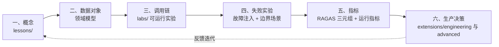
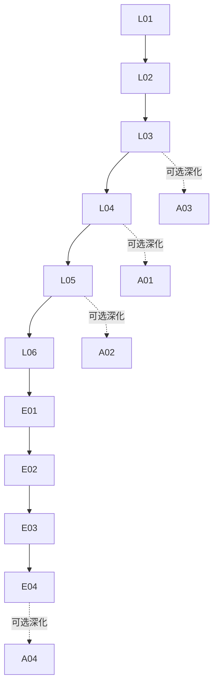
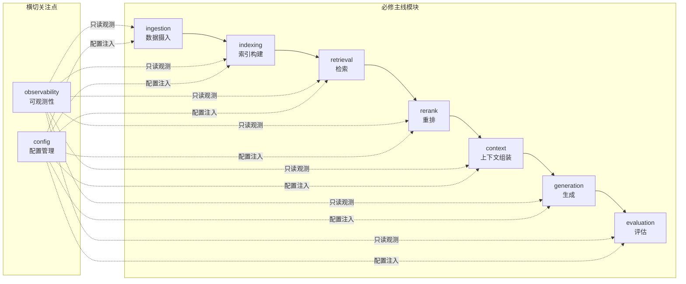
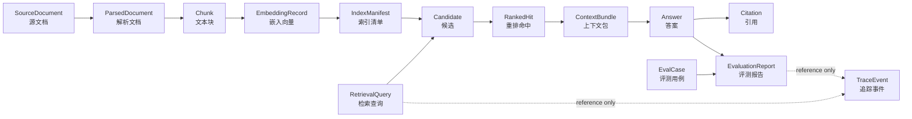

# RAG 重构架构：课程、实验与生产项目边界

> 文档编号：`MUJI-20-RAG-ARCH`<br>
> 架构版本：`0.1.1`（Stage 1 审查修订版）<br>
> 适用范围：阶段 03「RAG 检索增强生成」的课程载体、可运行实验项目、生产级参考项目<br>
> 上游输入：MUJI-17（RAG 教案重构要求）、MUJI-19-RAG-CONTRACTS（代码与数据契约基线 v1.0.0）、`datawhalechina/all-in-rag` 本地基准仓库 commit `64bd738`<br>
> 资料核对基准日：2026-08-29

---

## 0. 设计概览（架构师摘要）

### 0.1 当前设计阶段

**架构定义阶段**。本架构文档定义阶段 03 的「课程信息架构」「可运行实验项目的模块边界」「文档与产物的唯一归属规则」「架构决策（ADR）」与「非功能目标」。本阶段**不**编写整套课程、**不**实现业务代码、**不**替数据与接口工程师完成详细契约（详见 MUJI-19-RAG-CONTRACTS）。

### 0.2 输入需求版本

| 输入 | 版本 / 状态 | 对本架构的约束 |
|---|---|---|
| MUJI-17 父问题 | revision 12，`in_progress` | 要求把 RAG 教学从概览式 Markdown 重构为「能读代码、写代码、调试、交付」的工程化体系 |
| MUJI-19 代码与数据契约基线 | v1.0.0（已提交 `9ba2839`） | 定义 SourceDocument / ParsedDocument / Chunk / EmbeddingRecord / RetrievalQuery / Candidate / RankedHit / Citation / Answer / EvalCase / TraceEvent 的形状、ID 与不变量；本架构引用但不重述 |
| `all-in-rag` 基准仓库 | commit `64bd738` | 章节路线（C1–C9）与可运行示例作为「继承点」；其临时对象语义与弱评估作为「不应照搬的点」 |
| 项目工程准则 | v1.0 | 文档编号（`REQ-` / `ADR-` / `API-` / `MOD-` 等）、命名、模块边界、错误码规范 |
| 学习任务清单 | 53 任务 / 10 阶段 | 阶段 03 实际列出 8 个任务（3.1–3.8；原清单标题中的“7 个任务”为数量笔误），本架构须逐项映射到课程、实验、评测和阶段验收 |

### 0.3 设计闭环：概念 → 数据对象 → 调用链 → 失败实验 → 指标 → 生产决策

本架构以一条**教学—工程闭环**作为贯穿阶段 03 的主线，确保每个知识点都能被「讲清楚、跑起来、弄坏、量出来、想明白」：



| 环节 | 载体 | 核心问题 | 产出物 |
|---|---|---|---|
| 一、概念 | `lessons/` 教案 | 「为什么」与「是什么」 | 白话解释、原理、最小代码、练习 |
| 二、数据对象 | MUJI-19 契约 + `datasets/<dataset_id>/<version>/` 数据包 | 每个字段属于哪个类别（`F`/`D`/`O`） | 不可变领域对象、ID、不变量 |
| 三、调用链 | `labs/` 可运行实验 | 端到端如何跑通 | 可复现的 pipeline 运行结果 |
| 四、失败实验 | `labs/*/failures/` + `tests/boundary/` | 系统在何种输入/故障下如何降级 | 故障码、降级行为、回归测试 |
| 五、指标 | 版本化 dataset 包 + `results/` 运行产物 | 检索/生成/系统三层质量 | 量化分数、对比报告 |
| 六、生产决策 | `extensions/` | 离线 demo 与生产部署的差距 | 配置化、可观测性、成本/延迟预算 |

> **闭环纪律**：每个 `lab` 必须至少经历「正常跑通 → 注入一种失败 → 用指标量化差距 → 提出一种生产改进」。不允许「只跑通不破坏」的实验设计。

---

## 1. 课程信息架构：三层 + 阶段闸门

阶段 03 的课程内容按**三层**组织，层间有明确的**先修依赖**与**阶段闸门（Gate）**。

### 1.1 三层结构

| 层 | 目录 | 目标受众 | 对应任务 |
|---|---|---|---|
| **必修主线**（Required） | `lessons/` + `labs/` | 全体学员，达到 Junior–Mid RAG 工程师 | 3.1–3.6 |
| **工程扩展**（Engineering Extension） | `extensions/engineering/` | 希望达到 Mid–Senior、能交付生产级系统的学员 | 3.5（优化深度） |
| **选修前沿**（Elective Frontier） | `extensions/advanced/` | 希望接触 GraphRAG / Agentic RAG / 多模态等前沿方向的学员 | 3.7 + 拓展 |

#### 1.1.1 必修主线（Required）

必修主线按闭环六环节拆为 **6 个 lesson + 6 个 lab**，覆盖 Naive RAG → Advanced RAG → 评估的完整链路：

| Lesson | 主题 | 核心概念 | 配套 Lab |
|---|---|---|---|
| L01 | RAG 动机与三大范式 | Naive / Advanced / Modular；RAG vs 微调；LLM 局限性 | lab01：四步构建最小可行 RAG（MVP） |
| L02 | 数据准备：加载、清洗、分块 | 文档加载器、分块策略（递归/语义/Markdown 结构）、父子块 | lab02：分块策略消融实验（chunk size / overlap / 策略对比） |
| L03 | 嵌入与向量索引 | Embedding 模型、相似度（余弦/IP/L2）、FAISS/Chroma/Milvus 选型 | lab03：嵌入模型与向量库选型对比 |
| L04 | 检索优化：混合检索与重排 | 稠密 + 稀疏（BM25）、RRF 融合、Rerank（cross-encoder） | lab04：混合检索 + Rerank 前后指标对比 |
| L05 | 生成集成与引用校验 | Grounded generation、Prompt 模板、引用/claim 校验、abstain | lab05：带引用的生成 + 引用断裂实验 |
| L06 | 评估与可观测性 | RAGAS 三元组（Context Relevance / Faithfulness / Answer Relevance）、运行指标、TraceEvent | lab06：端到端评估 + 失败实验 + 指标报告 |

#### 1.1.2 工程扩展（Engineering Extension）

工程扩展面向「跑得稳」，强调**配置驱动、可观测性、评测门禁、失败实验系统化**：

| 模块 | 主题 | 核心能力 |
|---|---|---|
| E01 | 配置化 Pipeline | ProfileRef / 配置哈希 / 不可变配置；分块/嵌入/检索/生成全链路可配置 |
| E02 | 可观测性与追踪 | TraceEvent、stage 耗时、token 成本、OpenTelemetry 风格追踪 |
| E03 | 评测门禁与回归 | 评测集版本化、CI 回归、alias 切换的 compare-and-swap |
| E04 | 失败实验系统化 | 故障注入框架、边界场景清单、降级策略（fallback / abstain） |

#### 1.1.3 选修前沿（Elective Frontier）

| 模块 | 主题 | 与主线的关系 |
|---|---|---|
| A01 | GraphRAG（知识图谱 RAG） | 在 L04 检索之上引入图谱检索；参考 `all-in-rag` C7/C9 |
| A02 | Agentic RAG | 在 L05 生成之上引入「检索即工具调用」；为阶段 05 Agent 做铺垫 |
| A03 | 多模态 RAG | 在 L03 嵌入之上引入图文多模态嵌入；参考 `all-in-rag` C3 多模态 |
| A04 | 生产部署与成本工程 | 在 E01–E04 之上引入流式、缓存、成本核算；与阶段 07 衔接 |

### 1.2 依赖关系与阶段闸门



#### 1.2.1 先修依赖

| 模块 | 先修模块 | 依赖性质 |
|---|---|---|
| L02 | L01 | 概念依赖：理解 RAG 流程后才能设计分块 |
| L03 | L02 | 数据依赖：分块产物是嵌入的输入 |
| L04 | L03 | 数据依赖：向量索引是检索的基础 |
| L05 | L04 | 数据依赖：检索结果是生成的上下文 |
| L06 | L05 | 端到端依赖：评估需要完整 pipeline |
| E01 | L06 | 工程依赖：配置化需要理解全链路 |
| E02 | E01 | 依赖：追踪需要配置化的 stage |
| E03 | E02 | 依赖：评测门禁依赖可观测数据 |
| E04 | E03 | 依赖：失败实验依赖评测门禁 |

#### 1.2.2 阶段闸门（Gate）

每个 Gate 是**可验证的通过标准**，证据不足时不得推进：

| Gate | 位置 | 通过标准（可验证） | 验证方式 |
|---|---|---|---|
| **G1 跑通** | L02 后 | lab01 MVP 端到端跑通，输出可检索的 chunk 与向量索引 | `make lab01` 通过，输出 index manifest |
| **G2 优化** | L04 后 | 在固定 `dataset_id@version`、index 与 metric profile 下，lab04 的 Recall@5 比 Naive 基线绝对提升 ≥ 0.10（10 个百分点） | `make lab04` 输出带 dataset/index/profile/hash 的对比报告 |
| **G3 评估** | L06 后 | 在固定 `dataset_id@version`、system/metric profile 下，使用非 fixture 的真实本地/云端生成模型完成 lab06；Faithfulness ≥ 0.80，judge 使用独立真实模型或双人盲审，并至少完成 3 个失败实验 | `make lab06 MODE=quality` 拒绝 fixture profile，输出带 manifest/profile/hash 的评估报告、judge/人工复核证据 + 失败实验记录 |
| **G4 工程化** | E04 后 | 全链路配置化 + TraceEvent 可查 + CI 回归通过 | `make ci` 通过，trace 可查 |

### 1.3 与学习任务清单的映射

| 学习任务 | 本架构模块 | 交付物 |
|---|---|---|
| 3.1 RAG 概念与范式 | L01 + lab01 | 笔记 + MVP 代码 |
| 3.2 文档处理与向量化 | L02 + L03 + lab02 + lab03 | 分块消融报告 + 嵌入对比 |
| 3.3 向量数据库 | L03 + lab03 | 向量库选型对比 |
| 3.4 RAG 全流程项目 | L01–L05 + lab01–lab05 | 端到端项目上传 GitHub |
| 3.5 RAG 优化 | L04 + E01 + lab04 | 优化前后对比报告 |
| 3.6 RAG 评估 | L06 + E02 + lab06 | RAGAS 评估报告 |
| 3.7 开源 RAG 项目研读 | A01–A04（选读） | 500 字架构分析 |
| 3.8 阶段验收 | G1–G4 + lab01–lab06 | 3.4 项目、3.6 评估报告、可复现 README 与验收证据 |

---

## 2. 可运行实验项目的模块边界

本节定义 `code/stages/rag/` 下可运行实验项目的**模块清单、职责、输入/输出、失败语义、禁止依赖**。本架构只定义**模块级边界**，不替数据与接口工程师完成字段级契约（字段级见 MUJI-19-RAG-CONTRACTS）。

### 2.1 模块清单与依赖方向



### 2.2 各模块职责、输入/输出、失败语义与禁止依赖

#### M1 `ingestion`（数据摄入）

| 项 | 定义 |
|---|---|
| **职责**： | 从本地/仓库源连接器获取原始文档 → 解析为 ParsedDocument → 按 chunk profile 切分为 Chunk |
| **输入**： | `IngestionCommand{tenant_id, connector_id, items[], parser_profile, chunk_profile, idempotency_key}` |
| **输出**： | `IngestionReport{SourceDocument[], ParsedDocument[], Chunk[], item_results}` |
| **成功/空结果语义**： | 相同来源 + 内容 + profiles 且最新状态仍 active、来源事实未变 → `unchanged`；最新状态 tombstoned 时重新发现同来源 → `restored` 并追加 active 状态；URI/显示名/白名单 metadata 变化 → `metadata_updated`；空文档保留 SourceDocument 并隔离该项，不产生 ParsedDocument/Chunk |
| **阶段负责的错误**： | 读取、媒体类型、解码、解析、超长块、内容哈希 |
| **失败语义**： | `EMPTY_DOCUMENT` → 隔离（quarantined）；`DECODE_ERROR` → 隔离；`CONTENT_HASH_MISMATCH` → 拒绝 bytes；`CHUNK_TOO_LARGE` → 隔离 |
| **禁止依赖**： | **禁止**依赖 indexing/retrieval/generation 任何下游模块；**禁止**直接调用 embedding 模型；**禁止**把运行时观测数据（latency/trace_id）写进领域对象 |

#### M2 `indexing`（索引构建）

| 项 | 定义 |
|---|---|
| **职责**： | 将 Chunk 按 embedding profile 生成 EmbeddingRecord → 写入向量后端 → 产出不可变 IndexManifest |
| **输入**： | `IndexBuildCommand{index_build_id, corpus_version, chunk_ids[], embedding_profile, index_profile, publish_alias?, expected_active_index_id?}` |
| **输出**： | `IndexBuildReport{IndexManifest, embedding_refs, item_results}` |
| **成功/空结果语义**： | 先写 staging；完整验证后 manifest `ready`；部分成功默认不发布 alias |
| **阶段负责的错误**： | embedding、维度、批写、后端 schema、manifest 校验、alias CAS |
| **失败语义**： | `EMBEDDING_DIMENSION_MISMATCH` → 拒绝写入，须新建索引；`INDEX_WRITE_FAILED` → 保留成功 item，可重试；`ACTIVE_INDEX_CHANGED` → CAS 冲突 |
| **禁止依赖**： | **禁止**依赖 retrieval/generation；**禁止**原地覆盖旧索引（必须新版本 + alias 切换）；**禁止**把分数/运行时元数据写进 IndexManifest |

#### M3 `retrieval`（检索）

| 项 | 定义 |
|---|---|
| **职责**： | 接收 RetrievalQuery → 查询改写 → 多通道（dense/sparse）召回 → 汇总为保留 `retrieval_channel/channel_rank/raw_score` 的 CandidateSet；不在本阶段执行 RRF |
| **输入**： | 完整 `RetrievalQuery`（含 original_text、normalized_text、filters、top_k、retrieval_profile、index_id、rewrite_steps） |
| **输出**： | `CandidateSet{query_id, index_id, candidates[]}` |
| **成功/空结果语义**： | 无命中返回 success + `candidates=[]`，不是 404/500 |
| **阶段负责的错误**： | 查询校验、filter、index readiness、后端超时 |
| **失败语义**： | `INVALID_FILTER` → 指出字段/operator，不执行搜索；`INDEX_NOT_READY` → 按 `retry_after_ms` 重试或读旧 alias；`NO_HITS` → success + 空 candidates |
| **禁止依赖**： | **禁止**依赖 generation；**禁止**把融合分数写回 Chunk/SourceDocument；**禁止**绕过 index manifest 直接读后端 |

#### M4 `rerank`（重排）

| 项 | 定义 |
|---|---|
| **职责**： | 对 CandidateSet 做 RRF 融合 + cross-encoder 精排 → 产出带全局 rank 的 RankedHitSet |
| **输入**： | `RerankCommand{query_id, candidate_ids[], rerank_profile, limit}` |
| **输出**： | `RankedHitSet{query_id, hits[], confidence}` |
| **成功/空结果语义**： | 空 candidates → success + 空 hits；低于阈值仍返回 hits，但全部 `eligible_for_context=false` |
| **阶段负责的错误**： | 候选引用、模型超时、分数非有限、profile 不兼容 |
| **失败语义**： | `LOW_CONFIDENCE` → hits 保留但不可进 context；rerank 超时 → 按 profile 降级到融合排名并标记 degraded，否则 504 |
| **禁止依赖**： | **禁止**依赖 generation/evaluation；**禁止**修改 Candidate；**禁止**把 rerank 分数写回来源对象 |

#### M5 `context`（上下文组装）

| 项 | 定义 |
|---|---|
| **职责**： | 按 assembly_profile 和 token_budget，将 RankedHit 组装为可注入 Prompt 的 ContextBundle |
| **输入**： | `ContextAssemblyCommand{query_id, ranked_hit_ids[], assembly_profile, token_budget}` |
| **输出**： | `ContextBundle{context_bundle_id, selected_hits[], token_budget, token_count, rendered_context, warnings[]}` |
| **成功/空结果语义**： | 无 eligible hit → 空 context bundle + `NO_ELIGIBLE_HITS` warning |
| **阶段负责的错误**： | token 预算、缺失 chunk、版本漂移、重复/冲突证据 |
| **失败语义**： | 单 chunk 超预算 → 跳过 + `CHUNK_EXCEEDS_REMAINING_BUDGET` warning（不得静默截断）；`CONTEXT_BUDGET_EXCEEDED` → profile 无合法选择时失败 |
| **禁止依赖**： | **禁止**依赖 generation/evaluation；**禁止**修改 Chunk/RankedHit；**禁止**调用 LLM |

#### M6 `generation`（生成）

| 项 | 定义 |
|---|---|
| **职责**： | 基于 ContextBundle 调用 LLM 生成带引用的 Answer → citation validator 读取冻结 chunk 复核 |
| **输入**： | `GenerationCommand{answer_id, query_id, context_bundle_id, generator_profile}` |
| **输出**： | `GenerationResult{Answer, Citation[]}` |
| **成功/空结果语义**： | 空上下文或低置信度 → `insufficient_evidence`（abstain），不创建伪 Answer |
| **阶段负责的错误**： | 模型超时、输出 schema、引用校验、长度截断 |
| **失败语义**： | `CITATION_SPAN_MISMATCH` → 可按 profile 重新生成一次，仍失败则无 Answer；`MODEL_OUTPUT_INVALID` → 有界重试；**绝不**把无引用校验的答案当作成功答案发布 |
| **禁止依赖**： | **禁止**反向依赖 retrieval/indexing 的内部状态；**禁止**修改 ContextBundle；**禁止**绕过 citation validator |

#### M7 `evaluation`（评估）

| 项 | 定义 |
|---|---|
| **职责**： | 加载评测集（EvalCase）→ 驱动 pipeline 运行 → 计算 RAGAS 三元组 + 运行指标 → 产出报告 |
| **输入**： | `EvaluationCommand{evaluation_run_id, dataset_manifest_uri, system_profile, index_id, metric_profiles[]}` |
| **输出**： | `EvaluationReport{per_case[], aggregate_metrics, failed_cases[]}` |
| **成功/空结果语义**： | 单 case evaluator 失败 → partial_success；聚合分母必须排除失败项并显式报告 |
| **阶段负责的错误**： | 数据版本、label 引用、评估器超时、指标不可计算 |
| **失败语义**： | `EVALUATION_LABEL_STALE` → label source version 不在目标 corpus/index，停止该 case；`CONTRACT_VALIDATION_ERROR` → 字段级 errors |
| **禁止依赖**： | **禁止**修改被测系统配置；**禁止**把 judge 输出回写为 ground truth；**禁止**依赖 production alias（固定 index_id） |

#### M8 `observability`（可观测性，横切）

| 项 | 定义 |
|---|---|
| **职责**： | 接收各阶段事件 → 产出 append-only TraceEvent；暴露运行指标（latency/token/count） |
| **输入**： | 各阶段上报的 stage_started / stage_completed / stage_failed / retried / fallback 事件 |
| **输出**： | `TraceEvent{trace_id, span_id, stage, event_type, status, input_refs, output_refs, metrics, problem?}` |
| **成功/空结果语义**： | 观测层失败不得阻塞主链路（fire-and-forget + 本地降级缓冲） |
| **阶段负责的错误**： | 事件格式非法 → 丢弃并计数，不抛异常 |
| **禁止依赖**： | **禁止**被领域模块反向依赖（领域模块不 import observability 业务逻辑）；**禁止**持有领域对象的可变引用，只通过 ID 引用；**禁止**在 metrics 中高基数正文（只记 ID/计数/哈希） |

### 2.3 核心数据流



**可溯源链**（必须能从任意答案反查）：

```
answer_id → citation_id → ranked_hit_id → chunk_id → parsed_document_id → source_version_id → source_document_id
```

任何环节不得依赖「当前最新文档」做隐式联接；所有引用必须带 `source_version_id`。

### 2.4 错误传播与可观测事件

| 阶段 | 关键错误码（节选） | 传播行为 | 可观测事件 |
|---|---|---|---|
| ingestion | `EMPTY_DOCUMENT` / `DECODE_ERROR` / `CONTENT_HASH_MISMATCH` / `CHUNK_TOO_LARGE` | 该项隔离，其余 item 继续 | `stage_completed{item_results}` + per-item `problem` |
| indexing | `EMBEDDING_DIMENSION_MISMATCH` / `INDEX_WRITE_FAILED` / `ACTIVE_INDEX_CHANGED` | 维度不匹配→拒绝写入；部分失败→manifest partial 不发布 alias | `stage_completed{manifest.state, coverage}` |
| retrieval | `INVALID_FILTER` / `INDEX_NOT_READY` / `NO_HITS` | 无命中→success 空 candidates；索引未就绪→可重试 | `stage_completed{candidate_count}` |
| rerank | `LOW_CONFIDENCE` / `UPSTREAM_TIMEOUT` | 低置信度→hits 保留但不可进 context；超时→降级或 504 | `stage_completed{hits_count, eligible_count}` + degraded 标记 |
| context | `NO_ELIGIBLE_HITS` / `CONTEXT_BUDGET_EXCEEDED` | 无 eligible→空 bundle + warning | `stage_completed{token_count, selected_count, warnings}` |
| generation | `CITATION_SPAN_MISMATCH` / `MODEL_OUTPUT_INVALID` / `insufficient_evidence` | 引用失败→最多重试一次，仍失败则无 Answer；证据不足→abstain | `stage_completed{outcome, citation_count, finish_reason}` |
| evaluation | `EVALUATION_LABEL_STALE` / `CONTRACT_VALIDATION_ERROR` | label 过期→停止该 case；契约错误→字段级报告 | `stage_completed{evaluated_cases, failed_cases, aggregate_metrics}` |

> **错误传播纪律**：阶段内部错误不得跨阶段静默传播。retrieval 的 `NO_HITS` 在 generation 侧必须体现为 `insufficient_evidence`（abstain），**绝不允许**生成模块在无证据时「编造」答案。

---

## 3. 文档、源码、语料、评测集、测试、运行结果的唯一归属与链接规则

### 3.1 唯一归属矩阵

每个产物类型有且仅有一个归属模块/目录，避免「多处维护、互相矛盾」：

| 产物类型 | 唯一归属 | 责任人 | 禁止行为 |
|---|---|---|---|
| 教案（lesson） | `lessons/L0X_*.md` | 课程作者 | 禁止在 `labs/` 中重复讲解概念 |
| 实验代码 | `labs/labXX_*/` | 实验作者 | 禁止在 `lessons/` 中放完整实现代码 |
| 领域对象契约 | MUJI-19-RAG-CONTRACTS | 数据与接口工程师 | 禁止在本架构中重述字段级契约 |
| 版本化语料与评测真值 | `datasets/<dataset_id>/<version>/`（布局见 MUJI-19 §9） | 语料管理员 + 评测管理员 | 禁止复制出第二份 corpus/manifest；禁止把评测集与训练/调参数据混用 |
| 测试 | `tests/` | 各模块作者 + 自动化测试工程师 | 禁止把测试当作文档使用 |
| 运行结果 | `results/`（git-ignored，可复现） | 实验运行 | 禁止把运行结果当作验收证据（只认脚本 + 锁定配置） |
| 配置文件 | `configs/` | 配置管理员 | 禁止在代码中硬编码 profile |
| 参考资料 | `references.md` | 课程作者 | 禁止引用营销文章替代官方文档 |

### 3.2 链接规则

| 链接类型 | 规则 | 示例 |
|---|---|---|
| 教案 → 数据对象 | 通过契约编号链接到 MUJI-19 | 「Chunk 的形状见 `MUJI-19-RAG-CONTRACTS §3.3`」 |
| 实验 → 教案 | 每个 lab 头部声明依赖的 lesson | `prerequisites: [L01, L02]` |
| 实验 → 语料 | 通过 `dataset_id@version` 和 manifest 中的 `corpus.jsonl` 引用 | `dataset://rag_course_cooking/1.0.0/manifest.json#corpus.jsonl` |
| 实验 → 评测集 | 通过同一 manifest 中的 eval/ground-truth/label 文件引用 | `dataset://rag_course_cooking/1.0.0/manifest.json#eval_cases.jsonl` |
| 运行结果 → 配置 | 结果必须携带 `config_hash` + `profile_version` | `config_hash: sha256:7c9f...` |
| 运行结果 → 代码版本 | 结果必须携带 commit SHA | `code_version: 9ba2839` |
| 评测 → 失败实验 | 评测报告必须引用失败实验编号 | `failure_experiment: lab04-fail-03` |

> **唯一归属纪律**：当同一信息需要在多处出现时，只在一处作为**权威源（source of truth）**维护，其余位置通过**链接**引用。修改权威源即自动生效；禁止复制粘贴式同步。

---

## 4. 关键对象与接口的模块级边界

> **边界说明**：本节只定义**模块级边界**与**接口契约的传输无关签名**。字段级 schema、JSON 形状、ID 生成规则、不变量均已在 MUJI-19-RAG-CONTRACTS 中定义，本架构引用但不重述。

### 4.1 领域对象归属

| 领域对象 | 归属模块 | 类别 | 引用 |
|---|---|---|---|
| `SourceDocument` | ingestion | F + D（来源/生命周期事实 + 内容身份与校验派生值） | MUJI-19 §3.1 |
| `ParsedDocument` / `Chunk` | ingestion | D（派生） | MUJI-19 §3.2–3.3 |
| `EmbeddingRecord` / `IndexManifest` | indexing | D | MUJI-19 §3.4, §4.1 |
| `RetrievalQuery` / `Candidate` | retrieval | D | MUJI-19 §3.5–3.6 |
| `RankedHit` | rerank | D | MUJI-19 §3.7 |
| `ContextBundle` | context | D | MUJI-19 §4.2 |
| `Answer` / `Citation` | generation | D | MUJI-19 §3.8–3.9 |
| `EvalCase` | evaluation | F（领域事实） | MUJI-19 §3.10 |
| `TraceEvent` | observability | O（观测） | MUJI-19 §3.11 |

### 4.2 接口契约（传输无关签名）

以下 port 是稳定接口；Python 可实现为 `Protocol` + Pydantic DTO，HTTP/队列只是 adapter。**不得把 LangChain / LlamaIndex / Milvus / FAISS 的供应商对象穿过 port。**

```python
class IngestionPort(Protocol):
    def ingest(self, command: IngestionCommand) -> StageResult[IngestionReport]: ...

class IndexingPort(Protocol):
    def build(self, command: IndexBuildCommand) -> StageResult[IndexBuildReport]: ...

class RetrievalPort(Protocol):
    def retrieve(self, query: RetrievalQuery) -> StageResult[CandidateSet]: ...

class RerankPort(Protocol):
    def rerank(self, command: RerankCommand) -> StageResult[RankedHitSet]: ...

class ContextAssemblyPort(Protocol):
    def assemble(self, command: ContextAssemblyCommand) -> StageResult[ContextBundle]: ...

class GenerationPort(Protocol):
    def generate(self, command: GenerationCommand) -> StageResult[GenerationResult]: ...

class EvaluationPort(Protocol):
    def evaluate(self, command: EvaluationCommand) -> StageResult[EvaluationReport]: ...
```

### 4.3 框架适配边界

| 边界 | 规则 |
|---|---|
| 框架对象不得穿过 port | port 的输入/输出只接受 Pydantic DTO / 领域对象，不接受 `langchain.Document`、`llama_index.NodeWithScore`、`pymilvus.Hit` |
| adapter 层负责转换 | `adapters/langchain/`、`adapters/llamaindex/`、`adapters/milvus/` 负责供应商对象 ↔ 领域对象的双向转换 |
| 切换框架不改变 port | 从 LangChain 切换到 LlamaIndex 只改 adapter，不改 port 与领域对象 |

### 4.4 向量后端抽象边界

| 后端 | 抽象层 | 默认/可选 |
|---|---|---|
| FAISS | `adapters/faiss/` | **默认**（离线、无依赖、教学友好） |
| Chroma | `adapters/chroma/` | 可选 |
| Milvus | `adapters/milvus/` | 可选（生产级） |
| Qdrant | `adapters/qdrant/` | 可选（生产级） |

> 所有向量后端通过 `VectorStorePort(Protocol)` 抽象；dimension / metric / filterable_fields 由 IndexManifest 固化，后端 schema 必须与 manifest 一致。

---

## 5. 架构决策记录（ADR）

### ADR-001：原理实现与框架适配的关系

| 项 | 内容 |
|---|---|
| **状态** | 接受（Accepted） |
| **背景** | `all-in-rag` 早期章节直接用 LangChain / LlamaIndex 示例，学员容易「会调 API 但不理解调用链」。2026 年就业市场要求工程师既能用框架快速搭建，也能在框架不满足需求时手写核心逻辑。 |
| **备选方案** | A) 全程用框架（LangChain / LlamaIndex）；B) 全程手写不碰框架；C) **先手写最小实现建立直觉，再用框架适配** |
| **决策** | 采用方案 C：必修主线 L01–L03 用手写最小实现（不依赖框架），L04 起引入框架作为「adapter 层」；工程扩展 E01 明确框架对象不得穿过 port |
| **理由** | 手写最小实现让学员理解「调用链本质」（分块→嵌入→检索→生成），框架适配让学员掌握「生产级效率」。两者分层避免「黑盒依赖」 |
| **后果** | 课程开发工作量增加（需维护两套示例），但学员能力更扎实；框架升级时只需改 adapter 层 |
| **依据** | LangChain 官方文档「Get Started」强调理解核心概念后再用 LCEL [^1]；LlamaIndex 文档「Usage Pattern」推荐先理解索引结构再封装 [^2]；核对日期 2026-08-29 |

### ADR-002：离线可运行基线（无密钥路径）

| 项 | 内容 |
|---|---|
| **状态** | 接受（Accepted） |
| **背景** | 学员常因 API Key 缺失、网络限制、额度耗尽而无法跑通实验。教学实验必须保证「零密钥也能跑通基线」。 |
| **备选方案** | A) 全程依赖云端 API（OpenAI / DeepSeek）；B) **本地模型 + 本地嵌入 + FAISS 作为默认基线**，云端 API 作为可选扩展 |
| **决策** | 采用方案 B：默认检索基线使用本地嵌入模型（如 `bge-small-zh-v1.5`）+ FAISS；CI/零密钥契约回归使用版本化 deterministic fixture adapter；fixture 只证明调用链、schema 和失败恢复，不计入 G3 质量闸门。学员质量验收使用 Ollama 等本地真实模型（无 API Key）或云端模型，均通过 adapter 注入且不改变 port |
| **理由** | 保证任何学员在离线环境下跑通必修主线；云端 API 作为「进阶选项」而非「前置条件」 |
| **后果** | 本地模型效果弱于云端大模型，但足以演示流程；需在教案中明确「基线效果 ≠ 生产效果」 |
| **依据** | Ollama 官方文档支持本地运行开源模型 [^3]；sentence-transformers 支持离线嵌入 [^4]；FAISS 纯本地向量检索 [^5]；核对日期 2026-08-29 |

### ADR-003：依赖与版本策略

| 项 | 内容 |
|---|---|
| **状态** | 接受（Accepted） |
| **背景** | RAG 生态演进快（LangChain 0.3.x、LlamaIndex 0.12.x、RAGAS 0.2+），版本不锁定会导致「今天能跑明天跑不通」。 |
| **备选方案** | A) 始终用最新版；B) **锁定核心依赖版本 + 定期升级窗口** |
| **决策** | 采用方案 B：`requirements.txt` / `pyproject.toml` 锁定核心依赖版本（含 hash）；每季度评估一次升级；Python 最低 3.11+ |
| **理由** | 教学可复现性优先于「追新」；锁定版本 + hash 防止供应链漂移 |
| **后果** | 需维护版本矩阵；某些新特性可能延迟可用 |
| **依据** | Python Packaging User Guide 推荐锁定依赖版本以保证可复现性 [^6]；`all-in-rag` 仓库已采用 `requirements.txt` 锁定 [^7]；核对日期 2026-08-29 |

### ADR-004：向量后端抽象

| 项 | 内容 |
|---|---|
| **状态** | 接受（Accepted） |
| **背景** | 不同学员/项目对向量库的需求差异大（本地 demo 用 FAISS，生产用 Milvus/Qdrant）。直接绑定单一后端会限制适用性。 |
| **备选方案** | A) 只支持 FAISS；B) **通过 `VectorStorePort` 抽象，默认 FAISS，可选 Chroma/Milvus/Qdrant** |
| **决策** | 采用方案 B：定义 `VectorStorePort(Protocol)`，所有向量操作经 port；adapter 层负责后端切换 |
| **理由** | 教学上 FAISS 最简（无外部依赖），生产上可无缝切换到 Milvus/Qdrant |
| **后果** | 需维护多套 adapter；不同后端的 filter 语法差异需在 adapter 层抹平 |
| **依据** | FAISS 官方文档 [^5]；Milvus 文档 [^8]；Qdrant 文档 [^9]；LangChain VectorStore 抽象 [^1]；核对日期 2026-08-29 |

### ADR-005：评测/追踪边界

| 项 | 内容 |
|---|---|
| **状态** | 接受（Accepted） |
| **背景** | 评测（evaluation）与追踪（observability）容易被混为一谈。评测回答「系统好不好」，追踪回答「一次运行发生了什么」。 |
| **备选方案** | A) 把评测和追踪混在一个模块；B) **评测与追踪分离：评测产出聚合指标，追踪产出 append-only TraceEvent，两者只通过 ID 引用** |
| **决策**： | 采用方案 B：evaluation 模块产出 `EvaluationReport`（聚合指标），observability 模块产出 `TraceEvent`（运行观测）；TraceEvent 只通过 ID 引用领域对象，不成为对象的一部分 |
| **理由** | 职责分离：评测关注「质量」，追踪关注「过程」；TraceEvent 的 append-only 语义保证运行记录不可篡改 |
| **后果** | 需维护两套数据流；但各自独立演化，互不影响 |
| **依据** | RAGAS 官方文档定义 RAG 三元组评测 [^10]；OpenTelemetry 定义分布式追踪语义 [^11]；MUJI-19 §3.11 定义 TraceEvent 形状；核对日期 2026-08-29 |

### ADR-006：引用与可溯源性强制

| 项 | 内容 |
|---|---|
| **状态** | 接受（Accepted） |
| **背景** | RAG 系统的核心信任基础是「答案可溯源」。`all-in-rag` C8 的生成接口只返回字符串，引用和证据链丢失。 |
| **备选方案**： | A) 生成只返回字符串；B) **Answer 必须携带 Citation，事实性 claim 必须有 citation，否则 abstain** |
| **决策** | 采用方案 B：`Answer.claims[]` 中每个事实性 claim 至少一个 citation；citation validator 读取冻结 chunk 复核 span；校验失败不降级为「无引用成功答案」 |
| **理由** | 教学上让学员建立「有据可查」的工程习惯；生产上满足法律/医疗等严肃场景的可溯源要求 |
| **后果** | 生成模块复杂度增加（需 citation validator）；但这是 RAG 系统的必要成本 |
| **依据** | MUJI-19 §3.8–3.9 定义 Citation/Answer 形状与不变量；Lewis et al. 2020 强调 RAG 的可溯源性 [^12]；核对日期 2026-08-29 |

### ADR-007：失败实验驱动教学

| 项 | 内容 |
|---|---|
| **状态** | 接受（Accepted） |
| **背景** | 传统 RAG 教学只展示「跑通」场景，学员遇到边界 case（空文档、维度不匹配、检索无命中）时无从下手。 |
| **备选方案**： | A) 只跑通不破坏；B) **每个 lab 必须包含至少一个失败实验（故障注入 + 边界场景），学员通过「看到失败」理解系统边界** |
| **决策** | 采用方案 B：每个 `lab/` 含 `failures/` 子目录，覆盖 MUJI-19 §7.1 的必测边界场景；失败实验产出故障码 + 降级行为 + 回归测试 |
| **理由** | 就业市场要求工程师能「调试 + 交付」，失败实验培养故障诊断能力 |
| **后果** | 课程开发工作量增加；但学员工程能力显著提升 |
| **依据** | MUJI-19 §7.1 定义必测边界场景；RAGAS 文档强调失败 case 分析 [^10]；核对日期 2026-08-29 |

---

## 6. 非功能目标及验证方式

| 非功能目标 | 可验证目标值 | 验证方式 | 兜底策略 |
|---|---|---|---|
| **可复现性** | 相同代码 + 配置 + dataset manifest → 确定性对象 ID 与相同结构化产物；真实模型文本只要求固定评测门槛，不承诺逐字节一致 | CI 跑 `make lab01-lab06`，校验 manifest/config/code hash，并比较 chunk/index/output/metric artifact checksum；真实模型路径比较指标与 schema | 锁定依赖版本（ADR-003）；确定性 ID（MUJI-19 §2.2）；区分 deterministic fixture 与真实模型 |
| **启动时间** | 离线基线冷启动（含嵌入模型加载）≤ 60s；索引缓存命中 ≤ 5s | `make bench-startup` 计时 | 索引持久化缓存（MUJI-19 §4.1 IndexManifest） |
| **无密钥路径** | CI 契约路径 100% 可在无 API Key、无 Ollama 环境下回归；学员 G3 可在无 API Key 环境用 Ollama 等真实本地模型完成，但 fixture 结果不得作为质量验收证据 | CI 清空云端密钥且禁用 Ollama，以 fixture 跑 schema/调用链/错误恢复；`make lab06 MODE=quality` 必须检测并拒绝 fixture generator/judge | 本地嵌入 + FAISS + deterministic fixture 负责工程回归；真实本地/云端模型 + 独立 judge/人工复核负责质量闸门（ADR-002） |
| **测试** | 单元测试 + 契约测试 + 边界场景测试覆盖率 ≥ 80% | `make test` + coverage 报告 | MUJI-19 §7.1 必测边界场景作为回归基线 |
| **性能预算** | 单 query 端到端（检索+生成）p95 ≤ 30s（离线基线） | `make bench-e2e` 输出延迟分布 | 超时降级（ADR-005 追踪 + ADR-007 失败实验） |
| **安全** | 无密钥/个人信息泄漏；日志只记 ID/计数/哈希 | 静态检查 + 日志审计 | MUJI-19 §1 禁止在日志中复制原文/完整 prompt/向量/密钥 |
| **成本** | 离线基线零 API 成本；在线模式可估算 token 成本 | `make cost-report` 输出 token 用量与估算 | Prompt Caching + 输出长度预算（`max_tokens`） |
| **可观测性** | 每次 pipeline 运行产出完整 TraceEvent 链 | `make trace` 输出 trace_id → 各 stage 事件 | TraceEvent append-only，失败不阻塞主链路（M8） |

---

## 7. 对 `all-in-rag` 的继承点、明确超越点和不应照搬的点

### 7.1 继承点（保留并强化）

| 继承项 | 来源 | 本架构如何保留 |
|---|---|---|
| 章节路线（C1–C9 的知识递进） | `all-in-rag` README 内容大纲 | 映射到 L01–L06 + A01–A04 的三层结构 |
| 菜谱语料（HowToCook）实战项目 | `all-in-rag` C8「尝尝咸淡」 | 作为 `datasets/rag_course_cooking/<version>/corpus.jsonl` 默认语料，lab01–lab06 围绕其展开 |
| 白话解释 + 最小代码风格 | `all-in-rag` 各章「白话解释」 | 沿用并强化为「白话解释 → 核心原理 → 最小代码 → 学员实践 → 工程扩展 → 复盘」 |
| 多模态嵌入（C3） | `all-in-rag` C3 | 作为 A03 选修前沿 |
| GraphRAG（C7/C9） | `all-in-rag` C7/C9 | 作为 A01 选修前沿 |

### 7.2 明确超越点（本架构比 `all-in-rag` 多做的）

| 超越项 | `all-in-rag` 现状 | 本架构改进 |
|---|---|---|
| **闭环教学** | 只展示「跑通」 | 概念→数据对象→调用链→失败实验→指标→生产决策闭环 |
| **代码与数据契约** | 临时对象语义（Document.metadata 原地修改、随机 UUID） | MUJI-19 定义不可变对象、确定性 ID、类别（F/D/O） |
| **引用与可溯源** | 生成只返回字符串 | Answer 必须携带 Citation，事实性 claim 必须有 citation |
| **评估深度** | C6 使用 LlamaIndex evaluator 展示局部评估，未建立版本化评测集与完整 RAGAS 三元组门禁 | L06 + lab06 端到端评估 + 失败实验 + 量化报告 |
| **可观测性** | 无 TraceEvent | M8 observability 模块，append-only TraceEvent 链 |
| **工程扩展** | 无工程化内容 | E01–E04 配置化/可观测/评测门禁/失败实验系统化 |
| **离线基线** | 依赖云端 API | ADR-002 分两层：fixture 负责无模型的契约回归；Ollama 等真实本地模型负责无 API Key 的学习质量验收 |

### 7.3 不应照搬的点（明确摒弃）

| 摒弃项 | `all-in-rag` 现状 | 摒弃理由 | 本架构替代方案 |
|---|---|---|---|
| 临时对象语义 | `Document.metadata` 原地修改、随机 UUID 做 chunk ID | 破坏可复现性与可溯源性 | MUJI-19 不可变对象 + 确定性 ID（§2.2） |
| 框架先行 | C1 即引入 LangChain/LlamaIndex | 学员易成「调包侠」 | ADR-001 先手写最小实现，再框架适配 |
| 弱评估 | C6 只介绍不实操 | 学员无法量化系统质量 | L06 + lab06 端到端评估 + 失败实验 |
| 无失败实验 | 只展示跑通场景 | 学员无故障诊断能力 | ADR-007 每个 lab 必含失败实验 |
| 无引用校验 | 生成只返回字符串 | 无法建立「有据可查」习惯 | ADR-006 引用与可溯源性强制 |
| 无配置管理 | 参数硬编码在调用现场 | 无法工程化 | E01 配置化 Pipeline + ProfileRef |

---

## 8. 审批结论、风险与交接

### 8.1 审批结论

| 项 | 结论 |
|---|---|
| **当前设计阶段** | 架构定义阶段（Stage 1 审查修订版 v0.1.1） |
| **审批结论** | **接受（Accepted）**，可作为 Stage 2 课程、评测与实验实现的共同基线 |
| **通过证据** | 三层课程结构已覆盖任务 3.1–3.8；7 个 ADR 无未解决异议；跨文档 DTO、目录与 Trace 语义经合并前审查统一；非功能目标均给出可执行验证口径 |

### 8.2 风险 / 阻塞

| 风险/阻塞 | 影响 | 缓解 |
|---|---|---|
| MUJI-19 契约基线尚在演进 | 本架构引用其 v1.0.0，若其变更需同步更新 | 本架构只引用模块级边界，字段级变更不影响本架构 |
| 本地模型效果弱于云端 | 学员可能误判 RAG 上限 | 教案明确「基线效果 ≠ 生产效果」；云端 API 作为可选扩展 |
| 课程开发工作量较大 | 必修 6 lesson + 6 lab + 工程扩展 4 + 选修 4 | 分阶段交付：先必修主线（3.1–3.6），再工程扩展（3.5 深化），最后选修（3.7） |
| 评测集建设滞后 | lab06 依赖 `dataset://rag_course_cooking/1.0.0/manifest.json` | 优先建设 cooking 评测集（约 50 条），再扩展 zh_faq |

### 8.3 下一决策或交接

| 交接对象 | 交接内容 | 依赖本架构的什么 |
|---|---|---|
| **课程作者** | 按 L01–L06 + lab01–lab06 编写教案与实验 | 本架构的闭环六环节、三层结构、模块边界 |
| **数据与接口工程师** | 按 MUJI-19 契约实现字段级 schema | 本架构的模块级边界与 port 签名 |
| **自动化测试工程师** | 按 §6 非功能目标 + MUJI-19 §7.1 建设测试 | 本架构的失败实验清单与性能预算 |
| **产品与需求工程师** | 确认三层课程结构与任务映射 | 本架构 §1.3 映射表 |

---

## 9. 参考资料（2026 最佳实践，含核对日期）

| 编号 | 资料 | 类型 | 核对日期 |
|---|---|---|---|
| [^1] | LangChain 官方文档 — Get Started / LCEL / VectorStore：https://python.langchain.com/docs/ | 官方文档 | 2026-08-29 |
| [^2] | LlamaIndex 官方文档 — Usage Patterns / Evaluation：https://docs.llamaindex.ai/ | 官方文档 | 2026-08-29 |
| [^3] | Ollama 官方文档 — https://ollama.com/ 与 https://github.com/ollama/ollama | 官方文档 | 2026-08-29 |
| [^4] | sentence-transformers 官方文档 — https://www.sbert.net/ | 官方文档 | 2026-08-29 |
| [^5] | FAISS 官方文档 — https://faiss.ai/ 与 https://github.com/facebookresearch/faiss | 官方文档 | 2026-08-29 |
| [^6] | Python Packaging User Guide — https://packaging.python.org/en/latest/ | 官方文档 | 2026-08-29 |
| [^7] | `all-in-rag` 仓库 `code/requirements.txt` 依赖锁定实践 | 一手资料（本地基准仓库 commit `64bd738`） | 2026-08-29 |
| [^8] | Milvus 官方文档 — https://milvus.io/docs | 官方文档 | 2026-08-29 |
| [^9] | Qdrant 官方文档 — https://qdrant.tech/documentation/ | 官方文档 | 2026-08-29 |
| [^10] | RAGAS 官方文档 — RAG 三元组评测：https://docs.ragas.io/ | 官方文档 | 2026-08-29 |
| [^11] | OpenTelemetry 官方文档 — https://opentelemetry.io/docs/ | 官方文档 | 2026-08-29 |
| [^12] | Lewis et al. 2020. *Retrieval-Augmented Generation for Knowledge-Intensive NLP Tasks*. arXiv:2005.11401 | 论文（RAG 奠基作） | 2026-08-29 |
| [^13] | Gao et al. 2023. *Retrieval-Augmented Generation for Large Language Models: A Survey*. arXiv:2312.10997 | 论文（RAG 综述） | 2026-08-29 |
| [^14] | Gao et al. 2024. *Modular RAG: Transforming RAG Systems into LEGO-like Reconfigurable Frameworks*. arXiv:2407.21059 | 论文（模块化 RAG） | 2026-08-29 |

---

> **文档维护说明**：本架构文档由技术设计架构师维护。需求或架构变化时先做影响分析，更新本架构文档与 ADR 并重新批准，再通知项目经理同步任务、Skill 和实现。ADR 变更时更新并标注弃用原因，不静默覆盖已批准文档。
