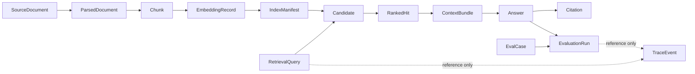

# RAG 代码与数据契约基线

> 文档编号：`MUJI-19-RAG-CONTRACTS`<br>
> 契约版本：`1.0.0`<br>
> 适用范围：文本 RAG 教学主线；接口设计，不包含检索或生成业务逻辑实现<br>
> 上游输入：MUJI-17 的纠偏要求、MUJI-18 的能力基线、`datawhalechina/all-in-rag` 本地基准仓库 commit `64bd738`

## 0. 这份契约解决什么问题

课程作者、后端实现者和测试工程师必须共享同一条可追踪数据链，而不能继续把正文、来源、分数、耗时全部塞进一个可变的 `Document.metadata`：



必须能从任意答案反查：`answer_id -> citation_id -> ranked_hit_id -> chunk_id -> parsed_document_id -> source_version_id -> source_document_id`。任何环节不得依赖“当前最新文档”做隐式联接。

### 0.1 对参考代码的具体审查结论

| 参考位置 | 观察到的运行时形状 | 本契约补上的边界 |
|---|---|---|
| `all-in-rag/code/C2/03_recursive_character_splitter.py` | LangChain `Document(page_content, metadata)`，分块参数仅存在于调用现场 | `Chunk` 固化分块 profile、字符跨度、内容哈希和来源版本 |
| `all-in-rag/code/C8/rag_modules/data_preparation.py` | 父文档 ID 是路径 MD5，chunk ID 是随机 UUID，元数据原地修改 | 逻辑文档 ID 与内容版本 ID 分离；同一输入和 profile 产生确定性 chunk ID |
| `all-in-rag/code/C8/rag_modules/index_construction.py` | `FAISS.from_documents` 后直接保存，未记录模型 revision、维度和索引覆盖率 | `EmbeddingRecord` 与不可变 `IndexManifest` 固化模型、维度、构建范围和校验和 |
| `all-in-rag/code/C8/rag_modules/retrieval_optimization.py` | 用正文 MD5 合并结果，并把 `rrf_score` 写回来源 metadata | `Candidate` 保存通道原始分数；`RankedHit` 保存融合/重排分数，来源事实不可变 |
| `all-in-rag/code/C4/01_hybrid_search.py` | Milvus collection 的向量维度固定，示例会 drop 后重建 | 维度变化必须创建新索引版本，验证后原子切换 alias，不原地破坏旧索引 |
| `all-in-rag/code/C8/rag_modules/generation_integration.py` | 生成接口只返回字符串，引用和证据链丢失 | `Answer`、`Citation`、`ContextBundle` 分离并强制引用校验 |
| `all-in-rag/code/C6/01_llamaindex_evaluation_example.py` | 查询和模型评分能落盘，但缺少稳定检索标注、答案标注和运行版本 | `EvalCase` 聚合语义，JSONL 分片保存真值、检索标注、答案标注；运行数据进入 `TraceEvent` |

结论：继承参考仓库的章节路线和可运行示例，但不继承其临时对象语义。

## 1. 数据分类与禁止事项

每个字段只属于以下一种类别：

| 标记 | 类别 | 定义 | 典型字段 | 所有者 |
|---|---|---|---|---|
| `F` | 领域事实 | 外部来源、用户或人工标注声明的事实；系统只能版本化，不能悄悄改写 | 原始 URI、用户原问题、人工真值、相关性等级 | 来源连接器、用户、标注员 |
| `D` | 派生数据 | 可由事实 + 明确版本的算法/profile 重建 | 解析文本、chunk、向量、分数、答案、引用 | 对应 pipeline stage |
| `O` | 观测数据 | 一次运行发生了什么，不参与领域对象相等性和业务判定 | trace、耗时、token、重试次数、异常 | 可观测性层 |

禁止：

1. 不得把 `latency_ms`、`trace_id`、异常栈写进 `Chunk`、`Answer` 等领域/派生对象。
2. 不得把 `rrf_score`、rerank 分数写回 `SourceDocument.source_metadata` 或 `Chunk`。
3. 不得把模型输出当作 `F`；模型生成的摘要、答案和自动评分一律为 `D`。
4. 不得用文件路径、数组下标或正文前 N 个字符作为跨运行 ID。
5. 不得在日志和 `TraceEvent` 中复制原文、完整 prompt、向量、密钥或个人信息；只记录 ID、计数、哈希和经过白名单的维度。

## 2. 通用表示约定

### 2.1 JSON 与类型

- 编码：UTF-8；JSONL 每行一个完整 JSON 对象，行尾 `LF`。
- 命名：JSON 字段统一 `snake_case`；代码中的 DTO/模型类使用 PascalCase。
- 时间：观测/作业时间及来源生命周期的 `state_effective_at` 使用 RFC 3339 UTC，例如 `2026-08-29T09:00:00Z`；领域有效时间属于来源事实（F），不得拿处理机本地时间推导内容身份（D）。
- 哈希：小写十六进制 SHA-256；哈希输入先按字段规定做 UTF-8 编码。禁止 MD5 用于身份或完整性。
- 数字：分数和向量元素必须是有限数；禁止 `NaN`、`Infinity`、`-Infinity`。
- 文本跨度：统一半开区间 `[start, end)`，按 Unicode code point 计数；不得混用 UTF-8 byte offset。
- URI：`source_uri` 是领域来源，`blob_uri` 是内部不可变内容地址，两者不可互换。
- 空值：缺失的可选字段省略；不得用空字符串、`0` 或 `"unknown"` 冒充缺失值。

为控制篇幅，示例中的 profile/config/text 哈希可能用 `sha256:7c9f...` 形式缩写；这是展示占位符。真实序列化和 schema 测试必须使用完整 64 位小写 hex，不能把省略号写入数据。

### 2.2 标识与版本

| 标识 | 生成规则 | 稳定范围 |
|---|---|---|
| `source_document_id` | UUIDv5(`tenant_namespace`, `connector_id + "\n" + external_source_id`) | 同一逻辑来源跨内容版本稳定 |
| `source_version_id` | `sv_` + SHA-256(原始 bytes) 前 32 hex | 内容逐 byte 相同即相同 |
| 派生对象 ID | `类型前缀_` + SHA-256(所有直接输入 ID + profile identity + 局部位置/内容哈希) 前 32 hex | 相同输入和算法配置可重建 |
| 交互/运行 ID | UUIDv7；客户端重试必须复用原 ID | 一次逻辑请求或运行 |
| `schema_version` | SemVer 字符串；本文为 `1.0.0` | JSON 对象结构/语义 |
| profile version | `profile_id@semver`，另带不可变 `config_hash` | 算法、模型、阈值或模板配置 |

ID 哈希采用长度前缀编码，而不是简单字符串拼接：`len(value) + ":" + value`。这样 `ab|c` 和 `a|bc` 不会碰撞。

### 2.3 统一 profile 引用

```json
{"profile_id":"chunk.markdown_recursive","profile_version":"1.2.0","config_hash":"sha256:7c9f..."}
```

profile 内容必须不可变；改变分隔符、tokenizer、模型 revision、阈值或 prompt 都产生新 `profile_version` 或新 `config_hash`。

### 2.4 公共嵌套类型

| 类型 | 精确形状 | 约束 |
|---|---|---|
| `ProfileRef` | `{profile_id: string, profile_version: string, config_hash: string}` | 三字段全必填；version 为 SemVer，hash 为 `sha256:` + 64 hex |
| `Span` | `{start: integer, end: integer}` | `0 <= start < end`；半开 code-point 区间 |
| `Element` | `{element_id, kind, text_span, page?, section_path}` | element ID 在 ParsedDocument 内唯一；page 从 1 开始 |
| `Claim` | `{claim_id, text_span, citation_ids[]}` | claim span 在 Answer.text 内；事实性 claim 至少一个 citation |
| `Warning` | `{code, stage, detail, item_ref?}` | code 稳定可机读；detail 不用于分支 |

`filters` 使用显式、可校验的递归语法，不接受供应商私有 SQL/expression 字符串：

```text
FilterExpr = {}
           | {"and": [FilterExpr, ...]}
           | {"or": [FilterExpr, ...]}
           | {"not": FilterExpr}
           | {"field": string, "operator": "eq"|"in"|"gte"|"lte", "value": scalar|scalar[]}
```

`{}` 表示不过滤。field 必须来自 index manifest 的 filterable-fields 白名单；类型与 operator 组合在请求进入 retrieval 前校验。

## 3. 核心领域对象

### 3.1 `SourceDocument`

**含义**：连接器发现的一份逻辑来源在某时刻的不可变内容/生命周期快照。原始 bytes 存对象存储，JSON 只携带地址、校验信息和可追加的状态事实。

| 字段 | JSON 类型 | 必填 | 类别 | 语义 |
|---|---|---:|:---:|---|
| `schema_version` | string | 是 | D | 固定 `1.0.0` |
| `source_document_id` | string | 是 | D | 逻辑来源 ID |
| `source_version_id` | string | 是 | D | 当前原始 bytes 的内容 ID |
| `source_state_id` | string | 是 | F | 本次生命周期状态事实的 UUIDv7；删除/恢复时追加新状态，不改旧快照 |
| `state_effective_at` | string(date-time) | 是 | F | 该状态事实生效时间，UTC RFC 3339 |
| `tenant_id` | string | 是 | F | 数据隔离边界 |
| `connector_id` | string | 是 | F | 来源系统/连接器稳定标识 |
| `external_source_id` | string | 是 | F | 来源系统内稳定主键；无主键时使用规范化 URI |
| `source_uri` | string(uri) | 是 | F | 人可追溯的原始位置 |
| `display_name` | string | 是 | F | 来源给出的显示名 |
| `media_type` | string | 是 | F | IANA media type，如 `text/markdown` |
| `byte_size` | integer >= 0 | 是 | D | 原始 bytes 长度 |
| `content_sha256` | string | 是 | D | 完整 64 hex 内容校验和 |
| `blob_uri` | string(uri) | 是 | D | 不可变原始内容地址 |
| `source_metadata` | object | 是 | F | 白名单来源属性；不得放运行分数 |
| `lifecycle_state` | enum | 是 | F | `active` / `tombstoned` |

- **ID/版本**：内容变化保留 `source_document_id`，生成新 `source_version_id` 和 `source_state_id`；删除/恢复保留内容版本，只追加新的 `source_state_id`；改名若 `external_source_id` 不变，不产生新逻辑文档。
- **所有者**：ingestion/source connector。
- **不变量**：读取 `blob_uri` 得到的 bytes 长度和 SHA-256 必须分别等于 `byte_size`、`content_sha256`；`source_state_id` 全局唯一，同一 `(tenant_id, connector_id, external_source_id, source_version_id, source_state_id)` 唯一；按 `(state_effective_at, source_state_id)` 排序后的最后一条事实决定当前 lifecycle state，历史快照不可改写。
- **常见错误**：`EMPTY_DOCUMENT`、`UNSUPPORTED_MEDIA_TYPE`、`CONTENT_HASH_MISMATCH`、错误地用本地绝对路径当跨环境 `source_uri`。

```json
{"schema_version":"1.0.0","source_document_id":"src_2f4f6f1a-3e67-5ea0-8f0d-57ab81c71822","source_version_id":"sv_9b63e28f7af74c37d8e34df8739dfc20","source_state_id":"0198f8c1-a129-7ca0-9c7a-e0e96f6cc201","state_effective_at":"2026-08-29T08:00:00Z","tenant_id":"course","connector_id":"repo_corpus","external_source_id":"cook/soup/tomato.md","source_uri":"repo://corpus/cook/soup/tomato.md","display_name":"番茄蛋汤","media_type":"text/markdown","byte_size":1842,"content_sha256":"9b63e28f7af74c37d8e34df8739dfc20a9d7f18a22f9b98d6ea64db0b729100","blob_uri":"blob://sha256/9b63e28f7af74c37d8e34df8739dfc20a9d7f18a22f9b98d6ea64db0b729100","source_metadata":{"category":"汤品"},"lifecycle_state":"active"}
```

### 3.2 `ParsedDocument`

**含义**：固定 parser profile 对 `SourceDocument` 的一次确定性解析结果。

| 字段 | JSON 类型 | 必填 | 类别 | 语义 |
|---|---|---:|:---:|---|
| `schema_version` | string | 是 | D | 契约版本 |
| `parsed_document_id` | string | 是 | D | `source_version_id + parser profile` 的派生 ID |
| `source_document_id` | string | 是 | D | 逻辑来源引用 |
| `source_version_id` | string | 是 | D | 被解析的精确内容版本 |
| `parser_profile` | ProfileRef | 是 | D | parser 名称、版本与配置哈希 |
| `detected_charset` | string | 是 | D | 实际采用字符集 |
| `replacement_char_count` | integer >= 0 | 是 | D | 解码产生的 U+FFFD 数量 |
| `text` | string | 是 | D | 规范化后的全文 |
| `text_sha256` | string | 是 | D | `text` 的 UTF-8 哈希 |
| `elements` | Element[] | 是 | D | 结构元素：`element_id/kind/text_span/page/section_path` |
| `parse_warnings` | string[] | 是 | D | 稳定机器码，不放异常文本 |

- **ID/版本**：`pd_` + SHA-256(`source_version_id`, parser profile identity)；parser 或配置变化必须产生新 ID。
- **所有者**：ingestion/parser adapter。
- **不变量**：element 的 `text_span` 必须落在 `text` 内且不逆序；`replacement_char_count > 0` 时必须含 `DECODE_REPLACEMENT_USED` warning；`text.strip()` 为空则不创建该对象。
- **常见错误**：`DECODE_ERROR`、`EMPTY_DOCUMENT`、页码基数混乱、element span 在换行规范化后失效。

```json
{"schema_version":"1.0.0","parsed_document_id":"pd_6779055046491642f3684851e3f7f25c","source_document_id":"src_2f4f6f1a-3e67-5ea0-8f0d-57ab81c71822","source_version_id":"sv_9b63e28f7af74c37d8e34df8739dfc20","parser_profile":{"profile_id":"parser.markdown","profile_version":"1.0.0","config_hash":"sha256:91f2..."},"detected_charset":"utf-8","replacement_char_count":0,"text":"# 番茄蛋汤\n\n## 原料\n番茄、鸡蛋","text_sha256":"3c4c...","elements":[{"element_id":"el_01","kind":"heading","text_span":{"start":0,"end":6},"section_path":["番茄蛋汤"]}],"parse_warnings":[]}
```

### 3.3 `Chunk`

**含义**：可检索的最小内容单元；它是 `ParsedDocument` 的派生视图，不是独立来源事实。

| 字段 | JSON 类型 | 必填 | 类别 | 语义 |
|---|---|---:|:---:|---|
| `schema_version` | string | 是 | D | 契约版本 |
| `chunk_id` | string | 是 | D | 确定性 chunk ID |
| `parsed_document_id` | string | 是 | D | 直接父输入 |
| `source_document_id` | string | 是 | D | 便于追溯的冗余引用 |
| `source_version_id` | string | 是 | D | 精确内容版本 |
| `chunk_profile` | ProfileRef | 是 | D | 分块算法与 tokenizer 配置 |
| `ordinal` | integer >= 0 | 是 | D | 同一 parsed document 内顺序 |
| `text` | string | 是 | D | chunk 正文 |
| `text_sha256` | string | 是 | D | 正文哈希 |
| `document_char_span` | Span | 是 | D | 在 `ParsedDocument.text` 中的跨度 |
| `token_count` | integer > 0 | 是 | D | 按 profile 指定 tokenizer 计算 |
| `section_path` | string[] | 是 | D | 从文档根到本块的标题路径 |
| `page_refs` | integer[] | 是 | D | 原始文档 1-based 页码；纯文本可为空 |
| `parent_chunk_id` | string | 否 | D | 父子检索的父块引用，必须同 source version |

- **ID/版本**：`chk_` + SHA-256(`parsed_document_id`, chunk profile identity, `ordinal`, span, `text_sha256`)。
- **所有者**：ingestion/chunker。
- **不变量**：`text == ParsedDocument.text[start:end]`，除非 profile 明确声明标题前缀注入；`token_count <= profile.max_chunk_tokens`；教学默认同时限制 UTF-8 bytes `<= 65536`；ordinal 从 0 连续递增。
- **常见错误**：`CHUNK_TOO_LARGE`、overlap 导致 span 错位、随机 UUID 使重建无法对比、父块跨 source version。

```json
{"schema_version":"1.0.0","chunk_id":"chk_1a3a555a2d1c6cfebbb7744a9a00c071","parsed_document_id":"pd_6779055046491642f3684851e3f7f25c","source_document_id":"src_2f4f6f1a-3e67-5ea0-8f0d-57ab81c71822","source_version_id":"sv_9b63e28f7af74c37d8e34df8739dfc20","chunk_profile":{"profile_id":"chunk.markdown_recursive","profile_version":"1.0.0","config_hash":"sha256:7c9f..."},"ordinal":0,"text":"## 原料\n番茄、鸡蛋","text_sha256":"b27a...","document_char_span":{"start":8,"end":19},"token_count":9,"section_path":["番茄蛋汤","原料"],"page_refs":[]}
```

### 3.4 `EmbeddingRecord`

**含义**：固定 embedding profile 对一个 chunk 内容生成的向量；不代表“已成功写入某索引”。

| 字段 | JSON 类型 | 必填 | 类别 | 语义 |
|---|---|---:|:---:|---|
| `schema_version` | string | 是 | D | 契约版本 |
| `embedding_id` | string | 是 | D | 内容 + 模型 profile 的派生 ID |
| `chunk_id` | string | 是 | D | 输入 chunk |
| `source_version_id` | string | 是 | D | 防止跨版本误联接 |
| `embedding_profile` | ProfileRef | 是 | D | provider/model/revision/config 的注册 profile |
| `input_sha256` | string | 是 | D | 实际送入模型的文本哈希 |
| `dimension` | integer > 0 | 是 | D | 向量维度 |
| `dtype` | enum | 是 | D | `float32` / `float16` / `int8` |
| `normalized` | boolean | 是 | D | 是否 L2 normalize |
| `vector` | number[] | 是 | D | 传输形态；持久层可外置但必须同哈希 |

- **ID/版本**：`emb_` + SHA-256(`chunk_id`, `input_sha256`, embedding profile identity, dimension, dtype, normalized)。
- **所有者**：indexing/embedder adapter。
- **不变量**：`len(vector) == dimension`；所有元素有限；profile 声明维度与记录一致；`input_sha256` 必须匹配实际模型输入而非未经模板处理的 chunk 文本。
- **常见错误**：`EMBEDDING_DIMENSION_MISMATCH`、模型 tag 漂移但 revision 未固定、空向量、normalize 配置与索引 metric 不一致。

```json
{"schema_version":"1.0.0","embedding_id":"emb_c2cc3375e4e35dfab48af61b06b8d817","chunk_id":"chk_1a3a555a2d1c6cfebbb7744a9a00c071","source_version_id":"sv_9b63e28f7af74c37d8e34df8739dfc20","embedding_profile":{"profile_id":"embed.bge-small-zh-v1.5","profile_version":"1.0.0","config_hash":"sha256:ada1..."},"input_sha256":"b27a...","dimension":4,"dtype":"float32","normalized":true,"vector":[0.0,0.0,0.6,0.8]}
```

> 示例为了可读性使用 4 维教学向量；真实 profile 的维度必须按模型锁定，不能拿此示例值建生产索引。

### 3.5 `RetrievalQuery`

**含义**：一次逻辑检索请求。用户原问题是事实，规范化/改写文本是派生数据，两者必须并存。

| 字段 | JSON 类型 | 必填 | 类别 | 语义 |
|---|---|---:|:---:|---|
| `schema_version` | string | 是 | D | 契约版本 |
| `query_id` | string | 是 | D | UUIDv7；逻辑重试复用 |
| `tenant_id` | string | 是 | F | 数据隔离边界 |
| `original_text` | string | 是 | F | 用户原始问题，禁止覆盖 |
| `normalized_text` | string | 是 | D | 实际用于检索的规范化/改写文本 |
| `locale` | string | 是 | F | BCP 47，如 `zh-CN` |
| `filters` | object | 是 | F | 调用者声明的结构化过滤条件 |
| `top_k` | integer 1..100 | 是 | F | 调用者期望候选数 |
| `retrieval_profile` | ProfileRef | 是 | D | 召回通道、各通道参数与候选阈值；不包含 RRF/重排参数 |
| `index_id` | string | 是 | D | 本次读取的不可变索引快照 |
| `rewrite_steps` | object[] | 是 | D | 每步 `kind/input_hash/output_text/profile` |

- **ID/版本**：首次请求分配 UUIDv7；超时重试必须提交原 `query_id` 和相同 payload。
- **所有者**：retrieval API；`original_text/filters/top_k` 的事实所有者仍是调用方。
- **不变量**：`original_text.strip()` 和 `normalized_text.strip()` 非空；过滤字段必须在索引 schema 白名单；同 `query_id` 的规范化 payload 哈希唯一。
- **常见错误**：`INVALID_FILTER`、`INDEX_NOT_READY`、`IDEMPOTENCY_CONFLICT`、改写覆盖原问题导致无法复盘。

```json
{"schema_version":"1.0.0","query_id":"0198f8d7-2f69-7aa1-bb32-77ea087b2c41","tenant_id":"course","original_text":"番茄蛋汤怎么做？","normalized_text":"番茄蛋汤 制作步骤 原料","locale":"zh-CN","filters":{"field":"category","operator":"eq","value":"汤品"},"top_k":20,"retrieval_profile":{"profile_id":"retrieve.hybrid_channels","profile_version":"1.0.0","config_hash":"sha256:fe71..."},"index_id":"idx_course_20260829_01","rewrite_steps":[{"kind":"query_rewrite","input_hash":"sha256:421d...","output_text":"番茄蛋汤 制作步骤 原料","profile":{"profile_id":"rewrite.cooking","profile_version":"1.0.0","config_hash":"sha256:8be2..."}}]}
```

### 3.6 `Candidate`

**含义**：一个检索通道返回的原始候选。相同 chunk 经 dense、sparse 两个通道命中时必须保留两条 Candidate。

| 字段 | JSON 类型 | 必填 | 类别 | 语义 |
|---|---|---:|:---:|---|
| `schema_version` | string | 是 | D | 契约版本 |
| `candidate_id` | string | 是 | D | query + channel + chunk 的派生 ID |
| `query_id` | string | 是 | D | 所属查询 |
| `chunk_id` | string | 是 | D | 命中块 |
| `source_version_id` | string | 是 | D | 命中来源版本 |
| `index_id` | string | 是 | D | 实际检索的索引快照 |
| `retrieval_channel` | string | 是 | D | 如 `dense`、`bm25`、`sparse` |
| `raw_score` | number | 是 | D | 通道原始分数 |
| `score_semantics` | enum | 是 | D | `higher_better` / `lower_better` |
| `score_kind` | string | 是 | D | 如 `cosine_similarity`、`l2_distance`、`bm25` |
| `channel_rank` | integer >= 1 | 是 | D | 通道内排名 |
| `normalized_score` | number | 否 | D | 仅按 profile 明确校准后提供 |

- **ID/版本**：`can_` + SHA-256(`query_id`, `index_id`, `retrieval_channel`, `chunk_id`)；同通道同块只能一条。
- **所有者**：retrieval/channel adapter。
- **不变量**：raw score 有限；`channel_rank` 在通道内唯一；禁止直接比较不同 `score_kind` 的 raw score。
- **常见错误**：把 distance 当 similarity 降序、跨通道 raw score 直接相加、chunk 属于非 index manifest 的 source version。

```json
{"schema_version":"1.0.0","candidate_id":"can_4070ae5762605c268f22a6dd176021c5","query_id":"0198f8d7-2f69-7aa1-bb32-77ea087b2c41","chunk_id":"chk_1a3a555a2d1c6cfebbb7744a9a00c071","source_version_id":"sv_9b63e28f7af74c37d8e34df8739dfc20","index_id":"idx_course_20260829_01","retrieval_channel":"dense","raw_score":0.812,"score_semantics":"higher_better","score_kind":"cosine_similarity","channel_rank":1,"normalized_score":0.812}
```

### 3.7 `RankedHit`

**含义**：融合/重排后具有全局次序的命中。Candidate 是“通道看到了什么”，RankedHit 是“排序阶段决定给下游什么”。

| 字段 | JSON 类型 | 必填 | 类别 | 语义 |
|---|---|---:|:---:|---|
| `schema_version` | string | 是 | D | 契约版本 |
| `ranked_hit_id` | string | 是 | D | query + rerank profile + chunk 的派生 ID |
| `query_id` | string | 是 | D | 所属查询 |
| `chunk_id` | string | 是 | D | 最终命中块 |
| `source_document_id` | string | 是 | D | 逻辑来源 |
| `source_version_id` | string | 是 | D | 精确来源版本 |
| `candidate_ids` | string[] | 是 | D | 贡献该 hit 的原始候选，至少一个 |
| `rank` | integer >= 1 | 是 | D | 全局排名 |
| `final_score` | number | 是 | D | 仅在同一 rerank profile 内可比较 |
| `score_components` | object | 是 | D | 通道分、融合分、reranker 分的命名分解 |
| `rerank_profile` | ProfileRef | 是 | D | RRF 参数、可选精排模型、fallback 与上下文准入阈值的唯一版本化配置 |
| `eligible_for_context` | boolean | 是 | D | 是否达到上下文阈值 |
| `decision_codes` | string[] | 是 | D | 如 `PASSED_THRESHOLD`、`DEDUPED_PARENT` |

- **ID/版本**：`hit_` + SHA-256(`query_id`, `chunk_id`, rerank profile identity)；分数算法变化生成新 ID。
- **所有者**：rerank stage。
- **不变量**：同一 query 的 rank 从 1 连续且唯一；candidate 全部指向相同 chunk；`eligible_for_context=false` 的 hit 不得进入 `ContextBundle.selected_hits`。
- **常见错误**：重排后丢失 Candidate 证据、仅返回正文没有 chunk ID、阈值变化未版本化、并列分数导致非确定顺序；并列时按 `chunk_id` 升序稳定打破。

```json
{"schema_version":"1.0.0","ranked_hit_id":"hit_a57f707790895e23d08072927459f04a","query_id":"0198f8d7-2f69-7aa1-bb32-77ea087b2c41","chunk_id":"chk_1a3a555a2d1c6cfebbb7744a9a00c071","source_document_id":"src_2f4f6f1a-3e67-5ea0-8f0d-57ab81c71822","source_version_id":"sv_9b63e28f7af74c37d8e34df8739dfc20","candidate_ids":["can_4070ae5762605c268f22a6dd176021c5","can_0a7c..."],"rank":1,"final_score":0.927,"score_components":{"rrf":0.0325,"cross_encoder":0.927},"rerank_profile":{"profile_id":"rerank.rrf_bge","profile_version":"1.0.0","config_hash":"sha256:d12a..."},"eligible_for_context":true,"decision_codes":["PASSED_THRESHOLD"]}
```

### 3.8 `Citation`

**含义**：答案中的某个 claim 与不可变来源片段之间的可验证关系，不是只有标题和 URL 的装饰。

| 字段 | JSON 类型 | 必填 | 类别 | 语义 |
|---|---|---:|:---:|---|
| `schema_version` | string | 是 | D | 契约版本 |
| `citation_id` | string | 是 | D | answer + claim + quote 的派生 ID |
| `answer_id` | string | 是 | D | 所属答案 |
| `claim_ids` | string[] | 是 | D | 该引用支撑的 Answer claim |
| `ranked_hit_id` | string | 是 | D | 来源命中 |
| `chunk_id` | string | 是 | D | 来源块 |
| `source_document_id` | string | 是 | D | 逻辑来源 |
| `source_version_id` | string | 是 | D | 精确来源版本 |
| `quote` | string | 是 | D | 用于验证的原文短引 |
| `chunk_char_span` | Span | 是 | D | quote 在 chunk 中的位置 |
| `quote_sha256` | string | 是 | D | quote 哈希 |
| `source_locator` | object | 是 | D | 显示名、section path、1-based page；不依赖本地路径 |

- **ID/版本**：`cit_` + SHA-256(`answer_id`, 排序后的 claim IDs, `chunk_id`, span, `quote_sha256`)。
- **所有者**：generation/citation validator。
- **不变量**：`quote == Chunk.text[start:end]` 且 quote 哈希匹配；citation 的 hit 必须存在于本次 `ContextBundle`；source version 必须与 chunk 一致。
- **常见错误**：`CITATION_SPAN_MISMATCH`、引用当前最新版本而非生成时版本、模型伪造 URL、引用块未进入 prompt。

```json
{"schema_version":"1.0.0","citation_id":"cit_828b2a6c9aa836949f6c0a8e4f776acf","answer_id":"0198f8dc-4b25-7d5e-a54b-bb6815b2e981","claim_ids":["clm_01"],"ranked_hit_id":"hit_a57f707790895e23d08072927459f04a","chunk_id":"chk_1a3a555a2d1c6cfebbb7744a9a00c071","source_document_id":"src_2f4f6f1a-3e67-5ea0-8f0d-57ab81c71822","source_version_id":"sv_9b63e28f7af74c37d8e34df8739dfc20","quote":"番茄、鸡蛋","chunk_char_span":{"start":6,"end":11},"quote_sha256":"5d5c...","source_locator":{"display_name":"番茄蛋汤","section_path":["番茄蛋汤","原料"],"pages":[]}}
```

### 3.9 `Answer`

**含义**：对一个查询和一个冻结上下文的生成结果。超时/模型异常返回 `ProblemDetails`，不创建伪 Answer；证据不足则创建明确 abstain 的 Answer。

| 字段 | JSON 类型 | 必填 | 类别 | 语义 |
|---|---|---:|:---:|---|
| `schema_version` | string | 是 | D | 契约版本 |
| `answer_id` | string | 是 | D | 生成前分配的 UUIDv7 |
| `query_id` | string | 是 | D | 输入查询 |
| `context_bundle_id` | string | 是 | D | 冻结上下文引用 |
| `outcome` | enum | 是 | D | `answered` / `insufficient_evidence` |
| `text` | string | 是 | D | 展示给用户的答案或拒答说明 |
| `claims` | Claim[] | 是 | D | `claim_id/text_span/citation_ids` |
| `citation_ids` | string[] | 是 | D | Answer 所有 citation 的去重列表 |
| `generator_profile` | ProfileRef | 是 | D | 模型、revision、prompt、解码参数 |
| `finish_reason` | string | 是 | D | 规范枚举，如 `stop`、`length`、`abstain` |

- **ID/版本**：answer ID 在调用模型前分配；重试若未确认前次是否成功，复用相同 `answer_id` 和 idempotency key。
- **所有者**：generation stage。
- **不变量**：`answered` 的事实性 claim 必须有 citation；claim span 落在 Answer.text；`insufficient_evidence` 不得伪造 citations；`finish_reason=length` 的结果默认不可发布。
- **常见错误**：`LOW_CONFIDENCE` 被当成系统异常、无证据仍强答、citation 覆盖率不足、重试产生两个不同答案并同时对外可见。

```json
{"schema_version":"1.0.0","answer_id":"0198f8dc-4b25-7d5e-a54b-bb6815b2e981","query_id":"0198f8d7-2f69-7aa1-bb32-77ea087b2c41","context_bundle_id":"ctx_d8f7685f152c1d99d678b0ddf3192c30","outcome":"answered","text":"番茄蛋汤的主要原料包括番茄和鸡蛋。","claims":[{"claim_id":"clm_01","text_span":{"start":0,"end":17},"citation_ids":["cit_828b2a6c9aa836949f6c0a8e4f776acf"]}],"citation_ids":["cit_828b2a6c9aa836949f6c0a8e4f776acf"],"generator_profile":{"profile_id":"generate.grounded_qa","profile_version":"1.0.0","config_hash":"sha256:c3d9..."},"finish_reason":"stop"}
```

### 3.10 `EvalCase`

**含义**：评测集中的一个不可变题例聚合。它表达“问什么、正确证据是什么、答案至少应满足什么”，不保存某次运行的评分。

| 字段 | JSON 类型 | 必填 | 类别 | 语义 |
|---|---|---:|:---:|---|
| `schema_version` | string | 是 | D | 契约版本 |
| `eval_case_id` | string | 是 | D | dataset + stable case key 的确定性 ID |
| `dataset_id` | string | 是 | F | 数据集稳定 ID |
| `dataset_version` | string | 是 | F | 不可变 SemVer 数据版本 |
| `case_key` | string | 是 | F | 标注系统稳定主键 |
| `split` | enum | 是 | F | `train` / `dev` / `test`；发布后不可改 |
| `query` | object | 是 | F | `text/locale/filters` |
| `ground_truth` | object | 是 | F | reference answer、required claims、允许的 abstain |
| `retrieval_labels` | object[] | 是 | F | source version、chunk、0..3 relevance grade |
| `reference_citations` | object[] | 是 | F | 允许支撑 required claim 的来源跨度 |
| `tags` | string[] | 是 | F | 场景/难度/故障类别 |

- **ID/版本**：`case_` + SHA-256(`dataset_id`, `case_key`)；修正文案或标注不改 case ID，但必须提升 `dataset_version` 并生成新 manifest。
- **所有者**：evaluation dataset curator；自动生成只能进入候选区，经人工确认才成为 `F`。
- **不变量**：所有 label 固定 `source_version_id`；test split 不得用于调参；relevance grade 只能 0..3；required claim 至少有一个 reference citation，除非 ground truth 规定应拒答。
- **常见错误**：训练/测试泄漏、只写参考答案不写相关 chunk、文档更新后 label 静默漂移、把 LLM judge 输出回写成真值。

```json
{"schema_version":"1.0.0","eval_case_id":"case_531c83082a8eca11bc23aa941c9e0975","dataset_id":"rag_course_cooking","dataset_version":"1.0.0","case_key":"cook-001","split":"test","query":{"text":"番茄蛋汤的主要原料是什么？","locale":"zh-CN","filters":{}},"ground_truth":{"reference_answer":"番茄和鸡蛋。","required_claims":["包含番茄","包含鸡蛋"],"allow_abstain":false},"retrieval_labels":[{"source_version_id":"sv_9b63e28f7af74c37d8e34df8739dfc20","chunk_id":"chk_1a3a555a2d1c6cfebbb7744a9a00c071","relevance_grade":3}],"reference_citations":[{"required_claim":"包含番茄和鸡蛋","chunk_id":"chk_1a3a555a2d1c6cfebbb7744a9a00c071","chunk_char_span":{"start":6,"end":11}}],"tags":["lookup","single_hop","zh"]}
```

### 3.11 `TraceEvent`

**含义**：一次 pipeline 运行中的不可变观测事件。它只通过 ID 引用数据对象，不成为对象的一部分。

| 字段 | JSON 类型 | 必填 | 类别 | 语义 |
|---|---|---:|:---:|---|
| `schema_version` | string | 是 | O | 观测事件 schema |
| `event_id` | string | 是 | O | UUIDv7 |
| `trace_id` | string | 是 | O | W3C/OpenTelemetry TraceId：32 个小写十六进制字符（16 bytes，非全零） |
| `span_id` | string | 是 | O | W3C/OpenTelemetry SpanId：16 个小写十六进制字符（8 bytes，非全零） |
| `parent_span_id` | string | 否 | O | 直接因果父 span 的 16 位小写十六进制 SpanId；根 span 省略，绝不能填 trace ID |
| `sequence` | integer >= 0 | 是 | O | 同 trace 内单调递增序号 |
| `stage` | enum | 是 | O | ingestion/indexing/retrieval/rerank/context/generation/evaluation |
| `event_type` | enum | 是 | O | `stage_started/completed/failed/retried/fallback` |
| `occurred_at` | string(date-time) | 是 | O | RFC 3339 UTC |
| `status` | enum | 是 | O | `ok/error/degraded` |
| `input_refs` | object | 是 | O | 输入对象 ID 列表 |
| `output_refs` | object | 是 | O | 输出对象 ID 列表 |
| `metrics` | object | 是 | O | 白名单数值，如 duration/token/count |
| `attributes` | object | 是 | O | 白名单低基数字段，如 profile/index ID |
| `problem` | ProblemDetails | 否 | O | 失败/降级原因，禁止异常栈 |

- **ID/版本**：event ID 使用 UUIDv7；trace/span ID 严格使用 W3C Trace Context / OpenTelemetry 的 32-hex TraceId 与 16-hex SpanId 表示；事件 append-only。
- **所有者**：observability adapter。
- **不变量**：同 trace 的 sequence 唯一；completed/failed 事件必须引用 started span；metrics 不能含正文；`status=error` 必须有 problem。
- **常见错误**：高基数正文进入 metrics、日志泄漏 prompt/密钥、重试未关联原 span、事件时间被当作领域对象创建时间。

```json
{"schema_version":"1.0.0","event_id":"0198f8de-064b-79ac-92af-3880777fd85d","trace_id":"4bf92f3577b34da6a3ce929d0e0e4736","span_id":"00f067aa0ba902b7","parent_span_id":"a2fb4a1d1a96d312","sequence":6,"stage":"retrieval","event_type":"stage_completed","occurred_at":"2026-08-29T09:00:00Z","status":"ok","input_refs":{"query_ids":["0198f8d7-2f69-7aa1-bb32-77ea087b2c41"]},"output_refs":{"candidate_ids":["can_4070ae5762605c268f22a6dd176021c5"]},"metrics":{"duration_ms":42,"candidate_count":20},"attributes":{"index_id":"idx_course_20260829_01","profile_id":"retrieve.hybrid_channels"}}
```

## 4. 辅助契约

核心对象之外，下列 DTO 是阶段边界所必需的，不得用未定义的 `dict[str, Any]` 代替。

### 4.1 `IndexManifest`

```json
{"schema_version":"1.0.0","index_id":"idx_course_20260829_01","index_build_id":"0198f880-a05f-71d0-8858-a13f2f03df02","tenant_id":"course","corpus_version":"corpus-1.0.0","chunk_profile":{"profile_id":"chunk.markdown_recursive","profile_version":"1.0.0","config_hash":"sha256:7c9f..."},"embedding_profile":{"profile_id":"embed.bge-small-zh-v1.5","profile_version":"1.0.0","config_hash":"sha256:ada1..."},"dimension":512,"metric":"cosine","filterable_fields":{"category":"string","difficulty":"string"},"source_version_ids":["sv_9b63e28f7af74c37d8e34df8739dfc20"],"expected_chunk_count":320,"indexed_chunk_count":320,"failed_chunk_count":0,"coverage":1.0,"content_checksum":"sha256:998e...","state":"ready"}
```

关键不变量：manifest 不可变；`coverage == indexed_chunk_count / expected_chunk_count`；索引 backend schema 的 dimension/metric 与 manifest 一致；只有 `state=ready` 才能绑定读 alias。

### 4.2 `ContextBundle`

```json
{"schema_version":"1.0.0","context_bundle_id":"ctx_d8f7685f152c1d99d678b0ddf3192c30","query_id":"0198f8d7-2f69-7aa1-bb32-77ea087b2c41","assembly_profile":{"profile_id":"context.top_hits","profile_version":"1.0.0","config_hash":"sha256:11e7..."},"token_budget":1800,"token_count":612,"selected_hits":[{"ranked_hit_id":"hit_a57f707790895e23d08072927459f04a","chunk_id":"chk_1a3a555a2d1c6cfebbb7744a9a00c071","render_order":1,"rendered_text_sha256":"b27a..."}],"rendered_context":"[S1] ## 原料\n番茄、鸡蛋","context_sha256":"2d87...","warnings":[]}
```

关键不变量：选中 hit 必须 `eligible_for_context=true`；总 token 不超过 budget；rendered context 中的 `[S1]` 等锚点可无歧义映射到 hit；不得静默截断 chunk。

### 4.3 `ProblemDetails`

错误采用 RFC 9457 Problem Details（兼容原 RFC 7807 客户端），HTTP media type 为 `application/problem+json`：

```json
{"type":"https://contracts.example/rag/problems/embedding-dimension-mismatch","title":"Embedding dimension does not match index","status":409,"detail":"Expected 512 dimensions for idx_course_20260829_01, received 1024.","instance":"urn:request:0198f8e1","code":"EMBEDDING_DIMENSION_MISMATCH","stage":"indexing","retryable":false,"item_ref":{"chunk_id":"chk_1a3a555a2d1c6cfebbb7744a9a00c071"}}
```

必填扩展字段：稳定 `code`、`stage`、`retryable`。`detail` 可读但不参与客户端分支；不得包含堆栈、SQL、磁盘路径或供应商密钥。

### 4.4 `StageResult<T>` 与逐项结果

```text
StageResult<T> = {
  request_id: UUIDv7,
  status: "success" | "partial_success" | "failed",
  data?: T,
  item_results: ItemResult[],
  warnings: Warning[],
  problem?: ProblemDetails
}

ItemResult = {
  item_key: string,
  status: "created" | "updated" | "unchanged" | "failed" | "quarantined",
  outcome_code?: string,
  output_refs: object,
  problem?: ProblemDetails
}
```

`partial_success` 必须有至少一个成功项和一个失败/隔离项；顶层 failed 表示没有可提交输出或事务级失败。逐项失败不得用日志文本代替结构化 `problem`。`outcome_code` 是 stage-specific 稳定机器码，不扩张通用 status 枚举；ingestion 至少定义 `RESTORED`、`METADATA_UPDATED`，失败原因仍只放 `problem.code`。

## 5. Pipeline 阶段接口

### 5.1 传输无关签名

以下是稳定 port；Python 可以实现为 `Protocol` + Pydantic DTO，HTTP/队列只是 adapter。不得把 LangChain/LlamaIndex/Milvus/FAISS 的供应商对象穿过 port。

```python
class IngestionPort(Protocol):
    def ingest(self, command: IngestionCommand) -> StageResult[IngestionReport]: ...

class IndexingPort(Protocol):
    def build(self, command: IndexBuildCommand) -> StageResult[IndexBuildReport]: ...

class RetrievalPort(Protocol):
    def retrieve(self, query: RetrievalQuery) -> StageResult[CandidateSet]: ...

class RerankPort(Protocol):
    def rerank(self, command: RerankCommand) -> StageResult[RankedHitSet]: ...

class ContextAssemblyPort(Protocol):
    def assemble(self, command: ContextAssemblyCommand) -> StageResult[ContextBundle]: ...

class GenerationPort(Protocol):
    def generate(self, command: GenerationCommand) -> StageResult[GenerationResult]: ...

class EvaluationPort(Protocol):
    def evaluate(self, command: EvaluationCommand) -> StageResult[EvaluationReport]: ...
```

### 5.2 阶段 I/O、成功语义与失败边界

| 阶段 | 输入 | 输出 | 成功/空结果语义 | 阶段负责的错误 |
|---|---|---|---|---|
| ingestion | `IngestionCommand{tenant_id, connector_id, items[], parser_profile, chunk_profile, idempotency_key}` | `IngestionReport{SourceDocument[], ParsedDocument[], Chunk[], item_results}` | 相同来源+内容+profiles 且最新状态 active、来源事实未变为 `status=unchanged`；tombstoned 后重新发现为 `status=updated, outcome_code=RESTORED`；URI/显示名/白名单 metadata 变化为 `status=updated, outcome_code=METADATA_UPDATED`；空文档保留 SourceDocument 并隔离该项，不产生 ParsedDocument/Chunk | 读取、媒体类型、解码、解析、超长块、内容哈希、生命周期状态转换 |
| indexing | `IndexBuildCommand{index_build_id, corpus_version, chunk_ids[], embedding_profile, index_profile, publish_alias?, expected_active_index_id?}` | `IndexBuildReport{IndexManifest, embedding_refs, item_results}` | 先写 staging；完整验证后 manifest `ready`；部分成功默认不发布 alias | embedding、维度、批写、后端 schema、manifest 校验、alias CAS |
| retrieval | 完整 `RetrievalQuery` | `CandidateSet{query_id,index_id,candidates[]}` | 无命中返回 success + `candidates=[]`，不是 404/500 | 查询校验、filter、index readiness、后端超时 |
| rerank | `RerankCommand{query_id,candidate_ids[],rerank_profile,limit}` | `RankedHitSet{query_id,hits[],confidence}` | port 按 ID 从同一 pipeline snapshot 解析不可变对象；空 candidates 返回 success + 空 hits；低于阈值仍返回 hits，但全部 `eligible_for_context=false` | 候选引用、模型超时、分数非有限、profile 不兼容 |
| context assembly | `ContextAssemblyCommand{query_id,ranked_hit_ids[],assembly_profile,token_budget}` | `ContextBundle` | port 按 ID 解析不可变 RankedHit；无 eligible hit 返回空 context bundle + `NO_ELIGIBLE_HITS` warning | token 预算、缺失 chunk、版本漂移、重复/冲突证据 |
| generation | `GenerationCommand{answer_id,query_id,context_bundle_id,generator_profile}` | `GenerationResult{Answer,Citation[]}` | port 按 ID 解析冻结 ContextBundle；空上下文或低置信度返回 `insufficient_evidence`；不调用或停止模型由 profile 决定 | 模型超时、输出 schema、引用校验、长度截断 |
| evaluation | `EvaluationCommand{evaluation_run_id,dataset_manifest_uri,system_profile,index_id,metric_profiles[]}` | `EvaluationReport{per_case[],aggregate_metrics,failed_cases[]}` | 单 case evaluator 失败为 partial_success；聚合分母必须排除项并显式报告 | 数据版本、label 引用、评估器超时、指标不可计算 |

### 5.3 具体请求/响应最低字段

#### Ingestion

```json
{"schema_version":"1.0.0","request_id":"0198f900-0a10-7420-88f8-c9bc9876a610","idempotency_key":"ingest:repo-corpus:batch-20260829-01","tenant_id":"course","connector_id":"repo_corpus","items":[{"external_source_id":"cook/soup/tomato.md","source_uri":"repo://corpus/cook/soup/tomato.md","expected_content_sha256":"9b63..."}],"parser_profile":{"profile_id":"parser.markdown","profile_version":"1.0.0","config_hash":"sha256:91f2..."},"chunk_profile":{"profile_id":"chunk.markdown_recursive","profile_version":"1.0.0","config_hash":"sha256:7c9f..."}}
```

响应至少报告 `discovered_count/created_count/unchanged_count/quarantined_count/failed_count`，以及每个 `external_source_id` 的输出引用。目录遍历顺序不得影响输出 ID。

#### Indexing

```json
{"schema_version":"1.0.0","request_id":"0198f901-3e66-778d-a17f-bfb14b2e136e","idempotency_key":"index:course:corpus-1.0.0:bge-small-1","index_build_id":"0198f880-a05f-71d0-8858-a13f2f03df02","tenant_id":"course","corpus_version":"corpus-1.0.0","chunk_ids":["chk_1a3a555a2d1c6cfebbb7744a9a00c071"],"embedding_profile":{"profile_id":"embed.bge-small-zh-v1.5","profile_version":"1.0.0","config_hash":"sha256:ada1..."},"index_profile":{"profile_id":"index.faiss.cosine","profile_version":"1.0.0","config_hash":"sha256:6e3c..."},"publish_alias":"course_active","expected_active_index_id":"idx_course_20260820_01"}
```

响应必须区分“向量生成成功”和“索引写入成功”；只有二者都成功的 chunk 计入 `indexed_chunk_count`。alias 切换使用 compare-and-swap，冲突返回 `ACTIVE_INDEX_CHANGED`。

#### Retrieval 与 rerank

Retrieval 接受 3.5 的完整对象；响应只返回 Candidate，不返回供应商 `Hit`。Rerank 请求必须携带完整 query、candidate IDs 和 profile：

```json
{"schema_version":"1.0.0","request_id":"0198f902-b68d-7823-8d8a-99f4ff2d30fa","idempotency_key":"rerank:0198f8d7:profile-1","query_id":"0198f8d7-2f69-7aa1-bb32-77ea087b2c41","candidate_ids":["can_4070ae5762605c268f22a6dd176021c5"],"rerank_profile":{"profile_id":"rerank.rrf_bge","profile_version":"1.0.0","config_hash":"sha256:d12a..."},"limit":5}
```

`confidence` 的定义由 rerank profile 固化，例如 top-1 校准分数或 margin；禁止把任意库的 distance 直接叫 confidence。

#### Context assembly

```json
{"schema_version":"1.0.0","request_id":"0198f903-f667-7a83-b061-f66e8295c394","idempotency_key":"context:0198f8d7:profile-1","query_id":"0198f8d7-2f69-7aa1-bb32-77ea087b2c41","ranked_hit_ids":["hit_a57f707790895e23d08072927459f04a"],"assembly_profile":{"profile_id":"context.top_hits","profile_version":"1.0.0","config_hash":"sha256:11e7..."},"token_budget":1800}
```

若单个 chunk 超过剩余预算：默认跳过并写 `CHUNK_EXCEEDS_REMAINING_BUDGET` warning；只有 profile 明确支持、且能产生新派生 span 时才可压缩，不能静默截断原 Chunk。

#### Generation

```json
{"schema_version":"1.0.0","request_id":"0198f904-6cb3-7965-a141-0939f78657f7","idempotency_key":"answer:0198f8dc-4b25-7d5e-a54b-bb6815b2e981","answer_id":"0198f8dc-4b25-7d5e-a54b-bb6815b2e981","query_id":"0198f8d7-2f69-7aa1-bb32-77ea087b2c41","context_bundle_id":"ctx_d8f7685f152c1d99d678b0ddf3192c30","generator_profile":{"profile_id":"generate.grounded_qa","profile_version":"1.0.0","config_hash":"sha256:c3d9..."}}
```

生成 adapter 必须先解析结构化 claims/citations，再由 citation validator 读取冻结 chunk 复核；校验失败不能降级成“无引用成功答案”。

#### Evaluation

```json
{"schema_version":"1.0.0","request_id":"0198f905-58d5-7c10-88da-30f054bcf8d2","idempotency_key":"eval:rag-course-1.0.0:system-a","evaluation_run_id":"0198f905-3a93-75e9-a34c-a097a62bf8ed","dataset_manifest_uri":"dataset://rag_course_cooking/1.0.0/manifest.json","system_profile":{"profile_id":"rag.course.baseline","profile_version":"1.0.0","config_hash":"sha256:b441..."},"index_id":"idx_course_20260829_01","metric_profiles":[{"profile_id":"metric.recall_at_k","profile_version":"1.0.0","config_hash":"sha256:20e3..."},{"profile_id":"metric.faithfulness_judge","profile_version":"1.0.0","config_hash":"sha256:ad48..."}]}
```

每个 case 输出 `eval_case_id`、输入/答案引用、retrieval metrics、answer metrics、metric profile、status/problem。聚合必须同时报告 `total_cases/evaluated_cases/failed_cases`，禁止把失败 case 当 0 分而不说明。

## 6. HTTP 映射、认证与流控

核心契约传输无关；需要网络服务时统一映射为 `/v1`。同步接口在服务预算内完成，批量 ingestion/indexing/evaluation 返回作业。

| Method + Path | port | 成功响应 | 幂等来源 | 所需 scope |
|---|---|---|---|---|
| `POST /v1/ingestion-jobs` | ingestion | `202` + job ref | `Idempotency-Key` | `rag:ingest` |
| `POST /v1/index-builds` | indexing | `202` + job ref | `Idempotency-Key` | `rag:index` |
| `POST /v1/retrieval-queries` | retrieval | `200` StageResult | body `query_id` + header | `rag:query` |
| `POST /v1/rerank-runs` | rerank | `200` StageResult | header | `rag:query` |
| `POST /v1/context-bundles` | context | `200` StageResult | header | `rag:query` |
| `POST /v1/answers` | generation | `200` StageResult | body `answer_id` + header | `rag:generate` |
| `POST /v1/evaluation-runs` | evaluation | `202` + job ref | body run ID + header | `rag:evaluate` |
| `GET /v1/jobs/{job_id}` | async result | `200` job + StageResult | read-only | 对应写 scope |

- 网络模式使用 Bearer JWT；`tenant_id` 必须来自 token claim 并与 body 一致，不能信任 body 自报租户。
- `Content-Type: application/json`；错误为 `application/problem+json`。
- 服务返回 `X-Request-ID`；该值进入 TraceEvent，不注入领域对象。
- `429` 必须带 `Retry-After`；客户端仅在 operation 幂等且 problem `retryable=true` 时重试。
- API major version 使用 URI `/v1`；对象 schema 继续使用 SemVer，二者独立。
- 若未来增加 list endpoint，必须采用 opaque cursor + `limit`（默认 20，最大 100），不得暴露数据库 offset。

## 7. 错误目录与边界条件

| code | stage | HTTP | 可重试 | 规定行为 |
|---|---|---:|:---:|---|
| `CONTRACT_VALIDATION_ERROR` | 任意 | 400 | 否 | 字段级 errors；不启动 stage |
| `UNSUPPORTED_MEDIA_TYPE` | ingestion | 415 | 否 | 该 item failed，其余 item 可继续 |
| `EMPTY_DOCUMENT` | ingestion | 422 | 否 | SourceDocument 可登记；该 item quarantined；不产生 parsed/chunk |
| `DECODE_ERROR` | ingestion | 422 | 否* | 未给 charset override 时隔离；调用者修正 profile 后是新请求 |
| `CONTENT_HASH_MISMATCH` | ingestion | 409 | 否 | 拒绝 bytes；防止读到变化中的来源 |
| `CHUNK_TOO_LARGE` | ingestion | 422 | 否 | 隔离该 chunk/source version；必须修改 chunk profile 后重跑 |
| `EMBEDDING_DIMENSION_MISMATCH` | indexing | 409 | 否 | 禁止写入；新建与模型维度匹配的索引 |
| `INDEX_WRITE_FAILED` | indexing | 503 | 是 | 保留成功 item；相同 build/idempotency key 重试失败项 |
| `INDEX_PARTIAL_FAILURE` | indexing | 409 | 条件式 | manifest 可为 partial，但默认不发布 alias |
| `ACTIVE_INDEX_CHANGED` | indexing | 409 | 否 | CAS 冲突；重新读取 active manifest 后人工/编排器决策 |
| `INDEX_NOT_READY` | retrieval | 409 | 是 | 按 `retry_after_ms` 重试或读旧 alias |
| `INVALID_FILTER` | retrieval | 422 | 否 | 指出字段/operator，不执行搜索 |
| `UPSTREAM_TIMEOUT` | retrieval/rerank/generation/evaluation | 504 | 是 | 只按 stage fallback/retry policy 执行 |
| `NO_HITS` | retrieval | 不是错误 | - | success + 空 candidates；写 warning/metric |
| `LOW_CONFIDENCE` | rerank/generation | 不是错误 | - | hits 可返回但不可组 context；Answer abstain |
| `CONTEXT_BUDGET_EXCEEDED` | context | 422 | 否 | profile 无合法选择时失败；不得静默超预算 |
| `CITATION_SPAN_MISMATCH` | generation | 422 | 条件式 | 可按 profile 重新生成一次；仍失败则无 Answer |
| `MODEL_OUTPUT_INVALID` | generation/evaluation | 502 | 条件式 | 有界重试；保存 problem，不保存半解析对象 |
| `EVALUATION_LABEL_STALE` | evaluation | 409 | 否 | label source version 不在目标 corpus/index，停止该 case |
| `IDEMPOTENCY_CONFLICT` | 任意写操作 | 409 | 否 | 相同 key 的 payload hash 不同，拒绝覆盖 |

`*` “修改请求后可以再试”不等于原操作 `retryable=true`。客户端只自动重放完全相同的请求。

### 7.1 必测边界场景

| 场景 | 期望契约行为 | 必须观察的指标/记录 |
|---|---|---|
| 0 bytes 或只含空白 | `EMPTY_DOCUMENT`，item quarantined，0 ParsedDocument/Chunk | `ingestion_quarantined_total{code}` |
| UTF-8 中混入非法 bytes | strict profile 返回 `DECODE_ERROR`；lenient profile 记录 replacement count/warning | `parse_replacement_char_count` |
| 同内容重复导入 | 最新状态 active 且来源事实/profile 均未变时为 `status=unchanged`；若最新状态 tombstoned 则追加 active 快照并返回 `status=updated, outcome_code=RESTORED`；来源 URI/显示名/白名单 metadata 变化则追加状态快照并返回 `status=updated, outcome_code=METADATA_UPDATED`；仅 profiles 未变时复用完整派生链，profiles 变化时重建受影响的派生对象 | `ingestion_unchanged_total`、`ingestion_restored_total`、`ingestion_metadata_updated_total` |
| 不同来源 URI 但内容相同 | 默认保留两个 logical document，允许共享 blob；除非 dedupe policy 明确合并 alias | `duplicate_content_groups` |
| 单 chunk 超 profile 限制 | `CHUNK_TOO_LARGE`，不得让 embedding 静默截断 | `chunk_oversize_total`、chunk token p99 |
| embedding 512 -> 1024 维 | 原索引拒绝写；创建新 index build，ready 后切 alias | `embedding_dimension_mismatch_total`、build coverage |
| 检索无命中 | success + 空 CandidateSet；context 空；Answer `insufficient_evidence` | `retrieval_empty_rate`、abstain rate |
| 命中但全部低置信度 | RankedHit 保留审计信息但均不可进 context；Answer abstain | score distribution、low-confidence rate |
| rerank 超时 | 若 profile 允许，回退到融合排名并标记 degraded；否则 504 | timeout/fallback count、stage latency |
| 1000 chunks 中 17 个索引失败 | manifest `partial`、coverage 0.983；默认 alias 不切换；逐项可重试 | failed chunk IDs、coverage、write error codes |

## 8. 内容演化、幂等、重试与回滚

### 8.1 内容变更与删除

1. 连接器用 `(tenant, connector, external_source_id)` 找到稳定 `source_document_id`。
2. bytes hash 未变：先独立比较 lifecycle、来源事实和 parser/chunk profiles。tombstoned 来源追加同内容版本的 active 状态快照并返回 `status=updated, outcome_code=RESTORED`；URI/显示名/白名单 metadata 改变时追加状态快照并返回 `status=updated, outcome_code=METADATA_UPDATED`。profiles 未变时复用既有 ParsedDocument/Chunk/EmbeddingRecord；parser profile 变化时从 ParsedDocument 起生成新派生链，只有 chunk profile 变化时复用 ParsedDocument 并从 Chunk 起生成新派生链。只有 lifecycle、来源事实和 profiles 均未变时返回 `status=unchanged`；状态 outcome 与 profile 重建可同时发生。新派生链以及影响 filter 的来源事实变化都必须发布新 corpus/index manifest。
3. bytes hash 改变：新增 SourceDocument version、ParsedDocument、Chunk、EmbeddingRecord；旧版本保持可读。
4. 构建包含新版本的 immutable index，验证 coverage 和评测门槛后原子切换 alias。
5. 来源删除：保留 `source_document_id` 和最后的 `source_version_id`，追加具有新 `source_state_id/state_effective_at` 且 `lifecycle_state=tombstoned` 的 SourceDocument 状态快照，再建新 corpus/index；旧快照与旧 index 用于历史 Answer/Citation 复盘，按保留策略异步回收。

### 8.2 重建索引与模型维度变化

- `index_id`/`index_build_id` 永不复用；同 build 的重试只补失败项。
- 修改 embedding model revision、dimension、normalize、distance metric、chunk profile 中任一项，都新建 index。
- 禁止 drop active collection 后现场重建；采用 `staging -> validate -> ready -> alias CAS`。
- 发布门槛默认：`failed_chunk_count == 0`、manifest checksum 通过、smoke retrieval 通过。若课程实验允许 partial index，必须显式 `allow_partial_publish=true` 并记录批准阈值，不能沿用生产默认。

### 8.3 重复导入

| 条件 | 结果 |
|---|---|
| 同 external source + 同 bytes + 同 profiles + 最新状态 active + 来源事实未变 | `unchanged`，返回已有对象引用 |
| 同 external source + 同 bytes + parser 或 chunk profile 变化 | 保留 `source_version_id`；parser profile 变化时从 ParsedDocument 起、仅 chunk profile 变化时从 Chunk 起生成新派生 ID，并重建后续 embedding/index；若同时恢复或更新 metadata，仍返回对应 outcome code |
| 同 external source + 同 bytes + 最新状态 tombstoned + 同 profiles | 追加 active SourceDocument 状态快照，返回 `status=updated, outcome_code=RESTORED`；复用既有派生链并发布新 corpus/index manifest |
| 同 external source + 同 bytes + URI/显示名/白名单 metadata 变化 + 同 profiles | 追加 active 状态快照，返回 `status=updated, outcome_code=METADATA_UPDATED`；复用既有派生链，filterable metadata 变化时发布新 index manifest |
| 同 external source + 新 bytes | 新 source version 与全套派生链 |
| 不同 external source + 同 bytes | 两个 SourceDocument，共享 content-addressed blob；默认各自生成可追溯派生链 |
| 同 idempotency key + 同 payload hash | 返回第一次的 StageResult，不重复副作用 |
| 同 idempotency key + 不同 payload hash | `IDEMPOTENCY_CONFLICT` |

### 8.4 各阶段幂等键

| 阶段 | 幂等 identity | 重试时必须复用 | 允许的副作用 |
|---|---|---|---|
| ingestion | caller key + batch payload hash | request ID、key、items、profiles | upsert immutable objects；已有对象 no-op |
| indexing | `index_build_id` + payload hash | build ID、key、chunk set、profiles | staging upsert；单 chunk 重复写覆盖同 embedding ID |
| retrieval | `query_id` + payload hash | query ID、index ID、profile | 无持久业务副作用；结果可缓存 |
| rerank | query + sorted candidate IDs + profile | request/key | 无业务副作用；结果可缓存 |
| context | query + ordered hit IDs + profile + budget | request/key | immutable ContextBundle upsert |
| generation | `answer_id` + query/context/profile hash | answer ID、key | 最多一个可发布 Answer；供应商请求应带同 key |
| evaluation | `evaluation_run_id` + dataset/system/metric hash | run ID、key | per-case 结果 upsert；聚合可重算 |

### 8.5 重试策略

- 只对 `retryable=true` 自动重试；默认最多 3 次，exponential backoff + jitter，尊重 `Retry-After`。
- 重试复用逻辑 ID 和 idempotency key；每次尝试产生新 span，`parent_span_id` 指向原逻辑 stage span。
- 批任务只重试 failed items，不重新写 successful/unchanged items。
- 超时后状态未知的写操作必须先按 idempotency key 查询结果，不能直接换 key 重发。
- fallback 是可见的 `degraded` 成功，不伪装成正常成功；profile 必须预先允许该 fallback。

### 8.6 回滚

- 数据/索引回滚是 alias 从新 immutable index 原子切回上一 `ready` index；不是删除新索引或恢复旧 bytes。
- generation/evaluation profile 回滚同样通过 profile alias/配置发布记录，不修改历史 Answer/EvaluationRun。
- 回滚命令携带 `expected_active_index_id`，防并发覆盖；成功后产生 TraceEvent，包含 old/new index ID，不包含语料。
- 新索引至少保留到回滚窗口结束；历史 citation 所需 source/blob 保留期不得短于 Answer 审计期。

## 9. 语料、真值、标注与轨迹文件

### 9.1 数据集目录和 manifest

EvalCase 是逻辑聚合；物理 JSONL 按所有权拆分，避免模型运行结果污染人工真值。

```text
datasets/rag_course_cooking/1.0.0/
├── manifest.json
├── corpus.jsonl
├── eval_cases.jsonl
├── ground_truth.jsonl
├── retrieval_labels.jsonl
├── answer_labels.jsonl
└── trace_events.jsonl
```

`manifest.json`：

```json
{
  "schema_version": "1.0.0",
  "dataset_id": "rag_course_cooking",
  "dataset_version": "1.0.0",
  "corpus_version": "corpus-1.0.0",
  "contract_major": 1,
  "files": [
    {"path":"corpus.jsonl","record_type":"SourceDocument","records":50,"sha256":"f11a..."},
    {"path":"eval_cases.jsonl","record_type":"EvalCaseCore","records":30,"sha256":"af31..."},
    {"path":"ground_truth.jsonl","record_type":"GroundTruthRecord","records":30,"sha256":"65ce..."},
    {"path":"retrieval_labels.jsonl","record_type":"RetrievalLabel","records":86,"sha256":"8e62..."}
  ],
  "compatible_profiles": {
    "chunk_profile_ids": ["chunk.markdown_recursive"],
    "required_source_version_ids_checksum": "sha256:70c1..."
  }
}
```

manifest 不可变并覆盖所有必需文件。`answer_labels.jsonl` 和 `trace_events.jsonl` 可作为具体 run 的独立 artifact，由 run manifest 引用；若随基准发布，则也必须列入 files。

### 9.2 语料 `corpus.jsonl`

每行是一个不可变 SourceDocument 内容/状态快照。相同 `source_version_id` 可因删除或恢复出现多个不同 `source_state_id`。加载当前语料时，必须先按 `source_document_id` 分组，在每组全部状态中按 `(state_effective_at, source_state_id)` 选择唯一最新快照；仅当该最新快照的 `lifecycle_state=active` 时才纳入当前语料。禁止先过滤 active，否则会让后到的 tombstone 失效并复活旧内容。原始内容不内联，防止 JSONL 膨胀并保持 bytes 校验。

```jsonl
{"schema_version":"1.0.0","source_document_id":"src_2f4f6f1a-3e67-5ea0-8f0d-57ab81c71822","source_version_id":"sv_9b63e28f7af74c37d8e34df8739dfc20","source_state_id":"0198f8c1-a129-7ca0-9c7a-e0e96f6cc201","state_effective_at":"2026-08-29T08:00:00Z","tenant_id":"course","connector_id":"repo_corpus","external_source_id":"cook/soup/tomato.md","source_uri":"repo://corpus/cook/soup/tomato.md","display_name":"番茄蛋汤","media_type":"text/markdown","byte_size":1842,"content_sha256":"9b63e28f7af74c37d8e34df8739dfc20a9d7f18a22f9b98d6ea64db0b729100","blob_uri":"blob://sha256/9b63e28f7af74c37d8e34df8739dfc20a9d7f18a22f9b98d6ea64db0b729100","source_metadata":{"category":"汤品"},"lifecycle_state":"active"}
```

### 9.3 EvalCase core 与 ground truth

物理存储将 query identity 和人工答案事实拆开；加载器按 `(eval_case_id,dataset_version)` 组装 3.10 的 EvalCase。

`eval_cases.jsonl`：

```jsonl
{"schema_version":"1.0.0","eval_case_id":"case_531c83082a8eca11bc23aa941c9e0975","dataset_id":"rag_course_cooking","dataset_version":"1.0.0","case_key":"cook-001","split":"test","query":{"text":"番茄蛋汤的主要原料是什么？","locale":"zh-CN","filters":{}},"tags":["lookup","single_hop","zh"]}
```

`ground_truth.jsonl`：

```jsonl
{"schema_version":"1.0.0","eval_case_id":"case_531c83082a8eca11bc23aa941c9e0975","dataset_id":"rag_course_cooking","dataset_version":"1.0.0","reference_answer":"番茄和鸡蛋。","required_claims":[{"claim_key":"gtc-01","text":"包含番茄和鸡蛋"}],"acceptable_answer_patterns":["番茄.*鸡蛋","鸡蛋.*番茄"],"allow_abstain":false,"annotation":{"method":"human_double_review","guideline_version":"1.0.0","adjudication_status":"accepted"}}
```

人工标注来源可用 workspace member ID 或脱敏 annotator ID，但不得放姓名/email。`annotation` 是标注事实的 provenance，不是一次 RAG 运行的 TraceEvent。

### 9.4 检索标注 `retrieval_labels.jsonl`

一行只标一个 `(case, source version, chunk)`，便于增量复核和计算 Recall@k/MRR/nDCG。

```jsonl
{"schema_version":"1.0.0","eval_case_id":"case_531c83082a8eca11bc23aa941c9e0975","dataset_id":"rag_course_cooking","dataset_version":"1.0.0","source_document_id":"src_2f4f6f1a-3e67-5ea0-8f0d-57ab81c71822","source_version_id":"sv_9b63e28f7af74c37d8e34df8739dfc20","chunk_id":"chk_1a3a555a2d1c6cfebbb7744a9a00c071","relevance_grade":3,"supports_claim_keys":["gtc-01"],"annotation":{"method":"human_double_review","guideline_version":"1.0.0","adjudication_status":"accepted"}}
```

文档或 chunk profile 改变后，不得把旧 label 按相似文本猜测迁移；必须生成新 dataset version 并人工/确定性 span mapping 复核。

### 9.5 答案标注 `answer_labels.jsonl`

这是某次运行的评价派生数据，不能回写 ground truth。人工 judge 与模型 judge 必须区分。

```jsonl
{"schema_version":"1.0.0","evaluation_run_id":"0198f905-3a93-75e9-a34c-a097a62bf8ed","eval_case_id":"case_531c83082a8eca11bc23aa941c9e0975","answer_id":"0198f8dc-4b25-7d5e-a54b-bb6815b2e981","label_type":"human","dimensions":{"correctness":1.0,"faithfulness":1.0,"citation_correctness":1.0,"citation_completeness":1.0},"verdict":"pass","judge_profile":{"profile_id":"judge.human.course","profile_version":"1.0.0","config_hash":"sha256:19a2..."},"notes_code":[]}
{"schema_version":"1.0.0","evaluation_run_id":"0198f905-3a93-75e9-a34c-a097a62bf8ed","eval_case_id":"case_531c83082a8eca11bc23aa941c9e0975","answer_id":"0198f8dc-4b25-7d5e-a54b-bb6815b2e981","label_type":"model_judge","dimensions":{"faithfulness":0.96},"verdict":"pass","judge_profile":{"profile_id":"judge.faithfulness","profile_version":"2.1.0","config_hash":"sha256:852f..."},"notes_code":[]}
```

同一 `(run, case, answer, label_type, judge_profile)` 唯一。model judge 分数必须带完整 profile，不能跨 profile 直接比较。

### 9.6 运行轨迹 `trace_events.jsonl`

```jsonl
{"schema_version":"1.0.0","event_id":"0198f8de-064b-79ac-92af-3880777fd85d","trace_id":"4bf92f3577b34da6a3ce929d0e0e4736","span_id":"00f067aa0ba902b7","parent_span_id":"a2fb4a1d1a96d312","sequence":6,"stage":"retrieval","event_type":"stage_completed","occurred_at":"2026-08-29T09:00:00Z","status":"ok","input_refs":{"query_ids":["0198f8d7-2f69-7aa1-bb32-77ea087b2c41"]},"output_refs":{"candidate_ids":["can_4070ae5762605c268f22a6dd176021c5"]},"metrics":{"duration_ms":42,"candidate_count":20},"attributes":{"index_id":"idx_course_20260829_01","profile_id":"retrieve.hybrid_channels"}}
{"schema_version":"1.0.0","event_id":"0198f8de-19f1-7275-95a0-932974eea009","trace_id":"4bf92f3577b34da6a3ce929d0e0e4736","span_id":"8c72b32f9a4dbe11","parent_span_id":"00f067aa0ba902b7","sequence":7,"stage":"rerank","event_type":"fallback","occurred_at":"2026-08-29T09:00:01Z","status":"degraded","input_refs":{"candidate_ids":["can_4070ae5762605c268f22a6dd176021c5"]},"output_refs":{"ranked_hit_ids":["hit_a57f707790895e23d08072927459f04a"]},"metrics":{"duration_ms":1000},"attributes":{"fallback_profile_id":"rerank.rrf_only"},"problem":{"type":"https://contracts.example/rag/problems/upstream-timeout","title":"Reranker timed out","status":504,"detail":"Rerank budget of 1000 ms was exceeded.","instance":"urn:request:0198f902","code":"UPSTREAM_TIMEOUT","stage":"rerank","retryable":true}}
```

## 10. 版本兼容策略

### 10.1 Schema 演进

| 变更 | 版本 | 读者行为 |
|---|---|---|
| 新增可选字段；新增不改变既有语义的 warning code | minor | 旧 reader 忽略未知字段；新 reader 提供默认缺失语义 |
| 文档修正、示例修正，不改序列化 | patch | 无数据迁移 |
| 删除/重命名字段、改变类型/单位/必填性、改变 ID 哈希输入、改变枚举既有值含义 | major | 并行支持旧 major；提供显式 adapter/migration |
| 新增 enum 值 | 通常 minor | reader 若无法安全处理必须返回 `UNSUPPORTED_ENUM_VALUE`，不得猜默认分支 |

所有 producer 写自己实际输出的 `schema_version`。consumer 声明可接受 major/minor 范围：

- major 不同：拒绝并返回 `UNSUPPORTED_SCHEMA_VERSION`。
- major 相同、minor 更高：只在 consumer 遵守“忽略未知字段”时接受。
- 必填字段缺失：无论版本均拒绝，不用隐式默认修复。

### 10.2 API 与 profile 演进

- HTTP breaking change 发布 `/v2`，`/v1` 至少保留一个课程发布周期；退役前给出 `Deprecation`、`Sunset` 和 successor `Link`。
- model tag（如 `latest`）不能作为 profile revision；必须固定供应商 revision/commit 或模型文件哈希。
- profile 配置只增不改；alias 可切换到新版本，但历史对象保存精确 profile identity。
- 分数语义、阈值和 metric 变化视为 profile 变化，不一定提升对象 schema。

### 10.3 Dataset 演进

- 数据集目录按不可变 SemVer 发布；任何 query、ground truth、label、split、`source_version_id`、`source_state_id` 或 lifecycle/source metadata 变化至少提升 dataset patch/minor，并重算 manifest checksum；不得原地修改已发布版本目录。
- 会改变评测结论的标注规则或 split 变化提升 major/minor，不做原地 patch。
- corpus version、chunk profile 与 retrieval label 必须相容；不相容直接 `EVALUATION_LABEL_STALE`，不能按正文模糊匹配补救。
- 至少保留“当前 + 上一个”schema major 的读取 adapter；迁移工具输出新数据集，不覆盖旧目录。

### 10.4 兼容性测试最小集

1. 当前 producer -> 当前 reader round-trip。
2. 当前 producer 添加未知 optional 字段 -> 上一 minor reader 可读。
3. 缺必填字段、未知 major、未知关键 enum -> 明确拒绝。
4. JSONL 中一个坏行 -> 报行号/item problem；其他行按调用方 partial policy 处理。
5. ID golden tests：固定输入/profile 永远得到同 ID；修改任一哈希输入必得不同 ID。
6. 生命周期状态选择：固定 `active -> tombstoned -> restored(active)` 事件序列，断言每一步都先按 `source_document_id` 选择最新快照再判断状态；tombstoned 阶段不得返回旧 active，恢复阶段返回 `status=updated, outcome_code=RESTORED`，复用原 `source_version_id` 但使用新 `source_state_id`。
7. Profile 转换：固定相同 bytes，分别修改 parser profile 与 chunk profile；前者必须生成新的 ParsedDocument/Chunk 链，后者必须复用 ParsedDocument 并生成新的 Chunk 链，两者均不得返回 `status=unchanged`。
8. 排序配置归属：retrieval profile schema 出现 RRF 参数或 rerank profile 缺少融合算法 identity 时拒绝配置；同一 CandidateSet 修改 RRF 参数必须生成新的 RankedHit ID。

## 11. “术语 -> 代码 -> 对象 -> 指标 -> 故障”映射

| 术语 | 课程代码符号 | 运行时对象/引用 | 可观察指标 | 常见故障 |
|---|---|---|---|---|
| 原始文档 | `SourceDocument` | `src_*` + `sv_*` | bytes、created/unchanged/quarantined count | 空文档、内容哈希变化、重复导入 |
| 解析文档 | `ParsedDocument` / `ParserPort` | `pd_*` | parse success、replacement chars、element count | 乱码、页码/span 错、解析为空 |
| 分块 | `Chunk` / `ChunkerPort` | `chk_*` | chunks/doc、token p50/p95/p99、oversize count | 超长、overlap 错、随机 ID、上下文断裂 |
| 向量 | `EmbeddingRecord` / `EmbedderPort` | `emb_*` | batch latency、dimension、norm、failure count | 模型 revision 漂移、维度不符、静默截断 |
| 索引快照 | `IndexManifest` / `IndexStorePort` | `idx_*` | expected/indexed/failed、coverage、build duration | 部分写入仍发布、metric 不兼容、active drop |
| 检索请求 | `RetrievalQuery` | `query_id` | QPS、rewrite rate、filter reject、latency | 原问题被覆盖、非法 filter、读错 index |
| 通道候选 | `Candidate` / `RetrieverPort` | `can_*` | per-channel hit count、score distribution、Recall@k | distance/similarity 颠倒、跨通道裸分相加 |
| 重排命中 | `RankedHit` / `RerankerPort` | `hit_*` | MRR/nDCG、threshold pass、rerank latency | timeout、顺序不稳定、候选证据丢失 |
| 上下文组装 | `ContextBundle` / `ContextAssemblerPort` | `ctx_*` | token utilization、duplicate ratio、dropped hit count | 超预算、静默截断、低置信 hit 混入 |
| 引用 | `Citation` / `CitationValidator` | `cit_*` | citation correctness/completeness、span mismatch | 伪 URL、版本漂移、引用未进 prompt |
| 答案 | `Answer` / `GeneratorPort` | `answer_id` | answer rate、abstain rate、faithfulness、finish reason | 无证据强答、超时重复答案、length 截断发布 |
| 评测题例 | `EvalCase` / `DatasetLoader` | `case_*` | case coverage、label agreement、split distribution | 数据泄漏、标注过期、模型评分污染真值 |
| 运行轨迹 | `TraceEvent` / `TraceSink` | trace/span/event IDs | stage latency/error/retry/fallback、token/cost | 泄漏正文、span 断链、高基数 metrics |

## 12. 交付给实现与测试的约束清单

### 12.1 后端实现者

- 在 domain/contracts 模块实现本文 DTO；供应商类型只存在于 adapter。
- 所有写接口实现 idempotency key + payload hash 冲突检测。
- 所有 index/query/answer 保存精确 source/index/profile version，不读隐式 latest。
- 部分失败用 StageResult/ItemResult 表达；alias publish 与数据写入分事务边界。
- generation 完成前执行 citation span 和 source version 校验。

### 12.2 课程作者

- 每个示例至少打印一次对象 ID 链和相应 TraceEvent，而不是只打印自然语言正文。
- 修改 chunk size、embedding model、top_k、rerank 时同时展示 profile 变化、指标变化和故障模式。
- 讲解 LangChain `Document`、Milvus `Hit` 等库对象时，明确它们属于 adapter，展示如何映射为本文对象。
- 实验数据固定 manifest、dataset version 和 index ID，使学生结果可复现。

### 12.3 测试工程师的最小验收

- 逐对象 schema validation、round-trip、未知 optional 字段兼容测试。
- 全链追踪测试：从 Answer 的每个事实 claim 反查到冻结 SourceDocument bytes 并验证 quote。
- ID golden/property tests：确定性、碰撞输入编码、profile/version 敏感性。
- 逐项故障测试：空文档、乱码、重复内容、超长块、维度变化、无命中、低置信度、超时、部分索引失败。
- 并发测试：两个 index build 同时尝试切 alias，只有 expected active ID 匹配者成功。
- 重试测试：超时后相同 key 不产生重复 Answer/vector/index entry；不同 payload 同 key 返回 409。
- 回滚测试：切回旧 index 后，旧/新历史 Answer 的 citation 均仍可验证。

## 13. 决策摘要

1. **逻辑身份与内容版本分离**：支持内容更新、重建、历史引用和回滚。
2. **事实/派生/观测分离**：来源 metadata 不再被检索分数、耗时和错误污染。
3. **所有派生数据都携带 profile identity**：参数变化可解释、可比较、可重建。
4. **索引不可变并用 alias 发布**：模型维度变化、部分失败和回滚都不破坏在线快照。
5. **无命中和低置信度是正常业务结果**：系统应拒答，不把它们伪装成 500 或无依据答案。
6. **EvalCase 真值与运行评分分离**：人工事实、model judge 和 TraceEvent 各自有清楚所有权。
7. **错误、重试和幂等写进契约**：调用方不需要自行猜测哪些失败可安全重放。
